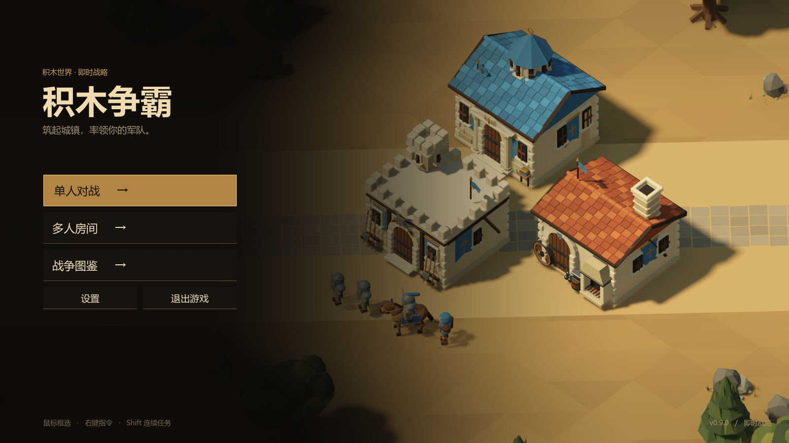

# 积木争霸

Godot 4.6 原创 3D RTS，采用暖色低多边形模型与 45° 正交视角。快速建立兵营，指挥混编军队，争夺金矿并摧毁敌方基地。支持单人对 Bot、1v1、2v2、3v3、4v4、2v2v2 三队混战和八人无队伍乱战，通过上海 ENet/DTLS 中继联机。



长矛兵模型与本次数值调整见 [制作与验证记录](report/spearman-2026-09-11.md)。

盾卫、战象v4已通过用户验收。轻骑兵v1已完成模型与试装，等待验收：70金币、90生命、近甲1/远甲3、7近战、对弓手+2、6.8移速、20视野、7秒训练。布帽、上衣和鞍毯提供队伍色，裸露马身与轻装骑手区别于骑士，详见 [轻骑兵制作与验证](report/light-cavalry-2026-09-12.md)。完整制作顺序见 [七单位计划](docs/unit-expansion-plan.md)，当前阶段见 [验收记录](docs/unit-expansion-status.md)。工程兵尚未开始；工程兵、牧师的计划移速同为3.5。

## 运行

用 Godot 4.6.3 导入 `project.godot` 后按 F5，主场景为原生大厅 `scenes/lobby.tscn`。Windows 发布包解压后运行 `windows/积木争霸.exe`，保持 EXE 与 PCK 同目录。使用 Forward+ Vulkan 渲染。

安装同版本导出模板后运行 `powershell -ExecutionPolicy Bypass -File tools/build_windows.ps1`。输出 `builds/积木争霸-Windows-x64.zip`；构建产物不纳入 Git。完整操作见 [玩家说明](docs/windows-readme.txt)，联机部署见 [中继文档](server/README.md)。

当前正式发行版 **0.12.0**，协议 **10**：启用原生批量模型、静止单位避让剪枝和路径查询缓存，减少重复实体采样与 JSON 编码，并将单批快照编码放到原生工作线程。同步只保留待发的最新状态，限制同一帧的发送量；短时音效和特效不再挤占可靠重传队列。公网中继采用正式运行模板，保留完整身份、内容、权限与限流校验，及时转发已验证消息。建议房主和客户端一同更新，服务端继续兼容协议10旧包。

本版以 **500 单位下的可玩性** 为优化范围。已测持续混编交战中，批量模型及静止剪枝组合约 **38.74 FPS / 30 TPS**；这不代表稳定60 FPS，也不是多人联机渲染帧率保证。共享流场和静态扫掠候选仍关闭。实际发布检查、测量范围和已知限制见 [0.12 发布报告](report/release-0.12.md)。

[下载0.12.0 Windows x64完整包](https://github.com/wanheng20031114/jimu-zhengba/releases/download/v0.12.0/jimu-zhengba-0.12.0-Windows-x64.zip)。解压后运行 `积木争霸.exe`，不要只复制EXE。

数值沿用0.11.0：剑士、投石车、加农炮视野统一为14，弓手7秒训练、骑士8秒训练；炮基础攻击40，仅对建筑增加100伤害。详见 [完整数值审查](report/balance-0.11.0.md)，报告以0.10.0为基线列出单位对位、攻防科技组合及训练与视野变化。电脑难度随席位配置同步，旧协议9中继或客户端不能混用。

异常后可运行发布包内 `COLLECT_DIAGNOSTICS.cmd`，在“文档/积木争霸-诊断”生成本地诊断ZIP；不会自动上传或修改设置。已复现问题、修复与诊断范围见 [稳定性调查](docs/crash-investigation-0.7.3.md)。

2026-09-10 新增选中单位与建筑的具体所属昵称、四档电脑难度，并调整大本营双塔及攻防数值（含剑士远程护甲1）。当前变化和验证见 [归属、难度与平衡调整](docs/ownership-ai-balance.md)；历史报告保留原发布数值。

## 对局

- 1v1 琥珀十字路（96×96）、2v2 双谷争锋（128×112）；新增 3v3 三线烽火（160×144）、2v2v2 三盟盆地（176×176）、4v4 四旗会战（192×184）、八人乱战落冠荒原（192×192）。各有独立原生地图，对称出生与永久矿脉。
- 房间最多八名真人或真人与 Bot 混合；4v4 每队最多四人，3v3 每队最多三人，2v2v2 每队最多两人，乱战每人独立阵营。可保留空位进行 4v2、3v1 或更少人数的乱战，空位不生成资产、不占收入或视野、不参与胜负。至少两个参战阵营，所有真人准备后由房主开始；电脑仅在房主主动添加时填入联机空位。
- 自己蓝色、队友黄色、所有敌人红色；仅同队共享视野。摧毁某方全部军事建筑即淘汰该方，其余各方继续对局，直到只剩最后一方。房主被淘汰仍继续主持比赛。
- 每人开局 1 座大本营、1 座守护左侧出生矿的已完工弓箭塔、3 农民、320 金币。开局塔免费，全部六种模式的真人与 Bot 均有一座，1000 生命，计入清建筑胜负。自然收入每秒 1，真人及普通电脑采矿每人每 3 秒 +4；困难/极难/噩梦电脑每次分别 +8/+12/+16。每处矿脉共享 6 个位置，额外农民等待空位。
- 大本营只训练农民：50 金币、10 秒，存活与排队合计基础上限10。学院一次性研究“农民上限扩展”，125金币、24秒，完成后仅该玩家上限提升至12，Bot同样需要付费研究。兵营训练剑士60金币/6秒、盾卫90金币/10秒、长矛兵40金币/6秒、弓手60金币/7秒、骑士80金币/8秒、战象300金币/30秒、轻骑兵70金币/7秒；兵营第2页为战象和轻骑兵；军工厂训练投石车与加农炮各20秒。军事人口基础50，可在学院升至75/100，每级500金币、30秒；剑士、盾卫、长矛兵、弓手、骑士、轻骑兵各占1，战象占5，攻城器占3，训练中预留的人口计入上限。
- 学院采矿效率 I/II/III 分别50/150/300金币、15/25/35秒，累计提速10%/20%/30%；保留当前采集进度，每次收益仍按该玩家的电脑难度倍率计算，自然收入每秒1金不变。
- 学院一次性“加长炮管”：240金币、30秒，现有及未来加农炮射程13→14，最小射程2.5不变。一次性“战地休整”：100金币、20秒，全部己方可移动单位（含农民、攻城器）连续10秒未受伤后，每满1秒恢复1生命；首次恢复发生在最后受伤11秒后。受伤重置等待和恢复进度，满血停止，建筑不受益，阵亡单位不会复活。
- 追击对准移动目标的新位置，近战在前摇中继续追步，远程进入完整出手距离后瞄准；原出手关键帧、射程和攻击间隔保持，命中时仍须目标实际在范围内。
- 每座生产建筑最多排队10项，学院最多6项。训练与研究在生产栏上方逐格显示进度，点击任意格子取消并全额退款，多选建筑超过10项可以翻页。训练完成但出口堵塞时等待出场；建筑被摧毁丢失队列且不退款。
- 农民建造、Shift 排队、施工接手；学院可预排全军攻防 I/II/III，攻击总加成为 +1/+2/+4、防御 +1/+2/+3。攻击每级100/250/500金币、20/35/50秒；防御每级150/300/600金币、25/40/60秒。仅作用于现有及未来军事单位，农民和建筑不受益；攻城器近甲永久0，仅远甲享受防御科技。跨学院不重复研究，取消前置时同时取消并退款依赖它的后续科技。
- 剑士110生命、近甲2/远甲2、攻击9、对骑兵+5；长矛兵75生命、近甲1/远甲1、攻击6、对骑兵+20。两者移动速度3.7、视野14、攻击间隔1.2秒。弓手60生命、近甲0/远甲5、攻击11、无类别加成；骑士（骑兵类别）120生命、近甲2/远甲7、攻击9、对弓手+3/攻城器+11。弓手/骑士视野14/16，攻击间隔1.5/1.1秒。无科技且不治疗时，长矛兵→骑士每击24、5击；剑士→骑士每击12、10击；弓手→剑士每箭9、13箭；弓手→骑士每箭4、30箭；骑士→弓手每击12、5击。农民150生命、双甲0、攻击5、1.3秒间隔、视野9。
- 战象360生命、近甲2/远甲3、26单体近战攻击、2.4秒间隔、0.55秒前摇、1.5射程、3.2移速、15视野、1.15半径。属于骑兵，长矛兵每击造成24、剑士每击12；没有波及伤害、骑士冲锋或骑手额外攻击。
- 投石车240金币、140生命、近甲0/远甲2、射程13/最小3、26基础范围伤害，对攻城器+20、对建筑+50，攻击间隔3秒；溅射半径2.7，范围内均匀满伤、无友军伤害，发射后落点固定。无科技对剑士24（5击）、弓手21（3击）、投石车44（4击）、加农炮44（5击），没有步兵附伤。加农炮255金币、180生命、近甲0/远甲2、射程13/最小2.5、40基础单体伤害，仅对建筑+100，3.2秒间隔；无科技对建筑130、同款炮38，同款需5炮。投石车与加农炮移动速度均为2，视野均为14。
- 摧毁敌队全部军事建筑及工地获胜。失去大本营仍可重建；全队完工核心生产建筑全失后，军事建筑永久暴露。
- Bot 可选普通/困难/极难/噩梦，农民每次采集收益分别为正常的1/2/3/4倍。单人难度适用于全部电脑将领，多人房主可逐电脑席位设置，所有玩家可见，变更后真人重新准备。默认普通；真人断线被电脑接管仍为1倍。电脑遵守相同人口、建造、生产、科技费用与视野，没有免费刷兵或拆楼奖励；难度不会放大自然收入。
- 防御塔20秒施工、1000生命、近甲10/远甲10、射程13，基础远程攻击16、对步兵+3/骑兵+9，1.5秒间隔；无科技对剑士17、弓手11、骑士18，自动攻击且无法驻军。大本营3000生命、双甲10、攻击40、射程10、2秒间隔；兵营/军工厂/学院生命1500/1800/1400、双甲10，均不享受军事攻防科技。旧地图的赤旗要塞同为40攻击，弩箭哨塔由14提高至17攻击。
- 防御塔第1～6次付费建造依次150/185/225/255/280/270金币，第6座起始终270；开局免费塔不计入。每次成功放置付费工地才增加本人的累计次数，取消、被摧毁或完工拆除均不回退。Shift 连建逐次检查最新报价，失败或重复命令不扣钱、不增加次数。取消工地返还“实付金额×未完成比例”向下取整，例如第二座185金、进度40%时返111金；完工拆除不退款。
- 兵营150金币/15秒；军工厂250金币/25秒、学院200金币/20秒，都要求已有完工兵营。大本营重建400金币/30秒，每人最多一座（含工地）。建筑可紧贴但不能重叠实际占地；全部出口被封时，训练完成的单位等待通路恢复。

| 操作 | 按键 |
|---|---|
| 选择、框选、同类选择 | 左键、拖动、双击；Ctrl + 左键同样全选当前视野内同种己方部队，Ctrl + Shift + 左键追加 |
| 移动/攻击/采矿/接手施工/集结点 | 右键目标 |
| 追加移动/攻击/采矿/建造任务 | Shift + 指派；Shift + H 将坚守排到队尾 |
| 攻击前进、停止、坚守 | A、S、H；S 与不带 Shift 的 H 立即清空后续任务 |
| 单位与建筑覆盖编队、追加、召回、定位 | Ctrl + 数字、Shift + 数字、数字、双按数字 |
| 切换混编建筑的生产类别 | Tab |
| 当前面板第1～6项生产/建造/研究/科技翻页 | Q、W、E、R、T、Y，按钮角落标出当前绑定 |
| 农民快速放置防御塔 | V；按住 Shift 连续放置 |
| 销毁所选己方单位或建筑 | Delete；完工资产不退款，工地按实际支付额返还未完成部分 |
| 视角移动、缩放、定位所选对象 | 窗口边缘/中键/方向键、滚轮、空格；窗口仍有焦点时，鼠标移出窗口仍可边缘移动 |
| 大本营、全军、空闲农民 | B、F2（或 G）、句点 |
| 操作帮助、菜单与设置 | F1、F5；主菜单和战场菜单都有“设置” |
| 取消当前指派或所选生产类别的队尾项目 | Esc；空队列不暂停 |
| 暂停或继续 | F5；联机全局暂停仅房主生效，普通客户端只打开本地菜单 |
| 全屏、隐藏界面、静音 | F11、F10、M |
| 单机调试金币 | F12，+100 |

快捷键依据当前面板从左向右排列：大本营 Q 农民；兵营 Q 剑士、W 盾卫、E 长矛兵、R 弓手、T 骑士、Y 战象；军工厂 Q 投石车、W 加农炮。农民建造与学院研究同样从 Q 开始；学院项目超过六项时出现“更多科技/返回科技”，按钮同样支持对应槽位快捷键，以当前角落提示为准。取消施工和拆除操作不会占用生产快捷键。多选同类生产建筑时，订单自动交给可用且队列时间最短的建筑。

设置包含窗口/无边框全屏/独占全屏、分辨率、垂直同步、帧率上限、音量与静音、边缘移动开关、镜头与缩放速度，以及35项可重新绑定的操作。显示模式或分辨率变更需在15秒内保留，否则自动恢复；界面按钮、编队与帮助提示同步显示实际热键。设置保存在本机，重新启动后保留。

## 图鉴与主菜单

主菜单以原生 3D 城镇呈现，单人模式、多人大堂、图鉴和设置分开进入。图鉴共25项：六种单位、五种建筑和十四项科技；拖动可旋转游戏内模型，生命、双护甲、伤害、类别加成、射程、训练与研究费用直接读取 Resource，防御塔注明阶梯造价与退款规则。图鉴只展示基础规则，局内实际科技仍以玩家状态为准。

更名后首次启动自动迁移旧版显示、声音、镜头、热键及房间偏好；若已有新版配置，保留新版值。不复制日志或联机凭据。

## 联机与工程

客户端主动连接 UDP 24571，中继只管理房间、身份和转发，房主运行 30 TPS 权威模拟。快照按墙钟最多每秒采样15批，纯数据交给一个后台 JSON 编码任务，不积压历史任务；主线程按真实帧和编码字节预算公平发送每名收件人的最新状态，可靠控制与结算优先。实际接收频率受房主处理机会、网络与发送预算限制，不能保证任何负载下每人15Hz。位置、朝向和攻击动画在120ms时间线插值。命令统一校验 owner、序号、资源与人口；客户端不判伤、不产金、不运行 Bot。局内原始消息按受信证书加密，私人密钥不进仓库。

每人独立控制资产，同队共享视野。在每位玩家自己的画面中，己方蓝色、盟友黄色、敌方红色，单位与建筑均有对应的旗帜、布面或屋顶色区。未探索、已探索与当前可见分开；失去视野的敌方单位与建筑不保留残影，最新快照中的消失实体立即移除；隐藏敌人的实时数据不会发给普通客户端。普通断线10秒后Bot接管、120秒内可恢复；房主等待30秒，超时中断，无自动迁移。

单位、建筑、科技、地图由 `data/` 原生 Resource 定义。模型、场景、界面均可编辑；生产按钮展示游戏内3D模型，活动预览15FPS更新。单位原生 `AnimationPlayer`、`NavigationAgent3D` 与物理插值保留动作细节。声音使用有界原生声部、分类增益和总线压缩，无BGM；录音许可与生成记录见 [音效来源](assets/audio/CREDITS.md)。

## 验证与重建

2026-09-10 的 [RTS 架构调查](report/rts-cpu-navigation-architecture-2026-09-10.md)结合 SC2／AoE IV 原始技术资料与新增 896 单位寻路计数，分析交错分频、分块流场、移动和动画成本，并给出分阶段验证方案。这是研究结果，尚未替换运行时导航或解决满人口性能。

**0.11.0 标准 272 单位样本保持约 30 TPS，896 单位的满人口性能问题仍未解决。** 最终采样使用 Godot 4.6.3 官方 Windows release 模板、生产场景与单位脚本，RTX 3080／1600×900。完整条件、耗时分布和 CPU／GPU 诊断见 [0.11.0 性能报告](report/performance-0.11.0.md)。

| 单位数 | 平均 FPS | 实际 TPS | 显示帧 P95 / P99 | SceneTree 回调 P95 |
|---|---:|---:|---:|---:|
| 272 | 130.80 | 29.999 | 14.896 / 17.696 ms | 8.061 ms |
| 896 | 3.31 | 25.386 | 346.321 / 347.524 ms | 27.729 ms |

SceneTree 回调不包含全部引擎物理、导航与显示工作，不能因为其 P95 低于 33.3 ms 就认定完整模拟达标。以上为预热后约 15 秒的本地样本，暂停 Bot 和自然收入、放大生命维持人口，保留用户编辑器和游戏；不能保证所有实战稳定 60 FPS。满人口画面仍会明显卡顿。

本版加入弹丸与特效复用、视口内小效果合并、迷雾行差分、小地图共享纹理、导航前缀查询与保守直线扫掠，以及视口外动画休眠；隐藏单位仍运行权威战斗。诊断中的关闭全部动画、关闭 3D 和 10 Hz 决策实验均不属于最终配置。

[0.10.0 历史报告](report/performance-0.10.0.md)采用编辑器引擎，与本次 release 模板、后台活动和战场状态不同，不能把全部差额归因于代码。另保留 [0.9.0 八人性能审查](report/eight-player-performance-review-0.9.0.md)与 [0.11.0 原生阶段诊断](report/performance-native-0.11.0.md)，后者使用临时 MSVC 计时引擎，不能作为发布帧率。

以本轮测试为准，旧0.5战役测试保留作历史参考，不适用于已移除的四楼战役规则。

```text
New-Item -ItemType Directory -Path .local -Force
Godot_console.exe --headless --path . --audio-driver Dummy --log-file .local/balance-matrix.engine.log --script tests/balance_matrix_test.gd
Godot_console.exe --headless --path . --audio-driver Dummy --log-file .local/balance-combat.engine.log --script tests/balance_combat_test.gd
Godot_console.exe --headless --path . --audio-driver Dummy --log-file .local/skirmish-match.engine.log --script tests/skirmish_match_test.gd
Godot_console.exe --headless --path . --audio-driver Dummy --log-file .local/fog-state.engine.log --script tests/fog_state_test.gd
Godot_console.exe --headless --path . --audio-driver Dummy --log-file .local/production-research.engine.log --script tests/timed_production_research_test.gd
Godot_console.exe --headless --path . --audio-driver Dummy --log-file .local/hud-queue.engine.log --script tests/hud_production_queue_test.gd
Godot_console.exe --headless --path . --audio-driver Dummy --log-file .local/context-hotkeys.engine.log --script tests/contextual_hotkeys_test.gd
Godot_console.exe --headless --path . --audio-driver Dummy --log-file .local/battle-settings.engine.log --script tests/battle_settings_integration_test.gd
Godot_console.exe --headless --path . --audio-driver Dummy --log-file .local/replica-selection.engine.log --script tests/replica_selection_lifecycle_test.gd
Godot_console.exe --headless --path . --audio-driver Dummy --log-file .local/catapult-impact.engine.log --script tests/catapult_impact_test.gd
Godot_console.exe --headless --path . --audio-driver Dummy --log-file .local/workforce-hud.engine.log --script tests/workforce_hud_test.gd
Godot_console.exe --headless --path . --audio-driver Dummy --log-file .local/tower-economy.engine.log --script tests/tower_economy_test.gd
Godot_console.exe --headless --path . --audio-driver Dummy --log-file .local/special-upgrades.engine.log --script tests/special_upgrades_test.gd
python tests/network_runner.py local
python tests/network_game_live_runner.py local
python tests/relay_timeout_lifecycle_runner.py
python tests/crash_stability_runner.py
python tests/diagnostic_logging_test.py builds/windows/积木争霸.exe
powershell -ExecutionPolicy Bypass -File tools/profile_skirmish.ps1
```

实现与验收记录：[生产与科技队列](docs/production-queues.md)、[遭遇战实施历史](docs/skirmish-implementation.md)、[0.7性能实测](docs/performance-0.7.0.md)、[联网验收](docs/network-validation.md)、[发布包完整对局](docs/release-match-validation.md)。0.7.0版本的标准混编2v2显示帧P95为15.81ms、P99为24.23ms；280人密集混战P95为31.92ms，仍不能锁定60FPS。完整采样条件与限制在性能报告中，另保留[0.6历史对照](docs/performance-0.6.0.md)。

建模脚本为 `tools/build_units.py`、`tools/build_environment.py`、`tools/build_skirmish_maps.py`；离线建模需要 Python、NumPy、SciPy、trimesh、Shapely，运行游戏无需这些依赖。

0.8.0 六人实测见[交付与性能记录](docs/release-0.8.0.md)：已修复432单位的实例着色器容量错误。共享机器上，204单位混编帧P95为25.74ms、432单位为100.12ms，极限规模未达稳定60FPS；固定逻辑平均保持约30TPS，完整物理开销仍接近预算边界。
