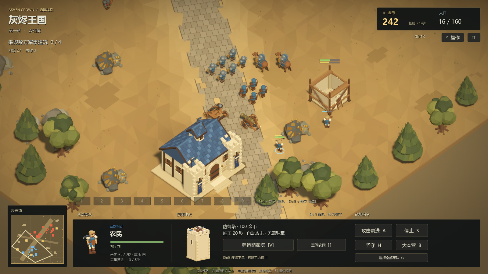

# 灰烬王国 · 中世纪乱斗

使用 **Godot 4.6** 制作的原创 3D 即时战略游戏。指挥蓝旗军团进攻敌方兵营、哨塔与要塞，让农民开采金矿并修建防御塔。战场采用 **45° 正交视角**，石板道路穿过岩石与树林，大本营负责即时招募。



## 运行

使用 Godot 4.6.3 或更新的 4.6 版本导入 `project.godot`，等待资源导入完成后按 **F5**（主场景为 `scenes/main.tscn`）。使用 Forward+ 渲染，建议独立显卡。

Windows 构建输出为 `builds/windows/AshenCrown.exe`；分发包路径为 `builds/AshenCrown-Windows-x64.zip`，解压后保留 EXE 和 PCK 在同一目录。构建产物不纳入 Git；已完成的发布包验证见 [验证记录](docs/validation.md)。

安装 Godot 4.6.3 的导出模板后，可运行 `powershell -ExecutionPolicy Bypass -File tools/build_windows.ps1` 重新打包。导出使用项目内的 Windows Desktop 原生预设，默认 Vulkan。

## 玩法

- 五种军事单位：剑士、弓箭手、骑士、投石车、加农炮；另有负责采矿和建造的农民。
- 选中大本营后消耗金币立即生产，无生产计时。
- 每秒自动增加 **1 金币**，**F12** 通过 `debug_gold` 输入映射增加 **100 金币**。
- 消灭守军并摧毁四座敌方军事建筑获胜；大本营被摧毁则失败。
- 敌方兵营定时派出援军，摧毁兵营可切断增援；摧毁军事建筑获得 90 金币。
- 连续对同一目标下达攻击命令会保留当前攻击进度；切换目标仍立即响应。
- 双方军事单位待命时会主动发现并追击附近敌人，击杀后继续寻找目标；**H 坚守**只攻击射程内敌人，保持原地。

开局拥有 **2 名农民**，额外招募每人 **50 金币**。选中农民后右键矿脉，农民到达矿边便持续工作，头顶进度条每 **3 秒**完成一次，立即增加 **3 金币**，无需运回大本营。矿脉储量无限，多名农民各自结算。移动或停止可中断采集，未完成的周期不入账；反复右键同一矿脉不会重置进度。选中大本营后右键矿脉，可让新招募农民直接前往采集。

选中农民按 **V** 显示防御塔预览，左键在空地放置，立即扣除 **100 金币**。农民抵达工地后累计施工 **20 秒**建成；每座塔同时由一名农民施工，多人不能加速。工人离开或死亡后，工地保留进度，可用另一名农民右键接手。工地可以受攻击；防御塔建成后自动射击范围内敌人，无进驻功能。

按住 **Shift** 可连续放置多座塔，也可将移动、采矿与施工混合排入任务队列。采矿有后续任务时，完成当前的一个 3 秒周期后转入下一项；队列最后的采矿任务会持续采集。选择未完成工地按 **Delete** 取消，按未完成比例返还金币并向下取整，例如施工一半返还 50 金币。普通 Delete 保护已完成塔；选择自家已完成塔按 **Ctrl + Delete** 可拆除，不返还金币。

| 操作 | 按键 |
| --- | --- |
| 选择 / 框选 | 左键 / 拖动左键 |
| 追加或取消选择 | Shift + 左键 / 框选 |
| 选择视野内同类单位 | 双击单位 |
| 移动 / 攻击 / 采矿 / 接手工地 / 大本营集结点 | 右键目标 |
| 追加移动、采矿或施工任务 | Shift + 右键 |
| 攻击前进 | A，再左键 |
| 停止 / 坚守 | S / H |
| 创建 / 覆盖编队 | Ctrl + 1–9 |
| 追加所选部队到编队 | Shift + 1–9 |
| 召回编队 / 定位编队 | 1–9 / 双按数字 |
| 移动镜头 | 中键拖动、方向键、屏幕边缘 |
| 缩放 / 定位所选部队 | 滚轮 / 空格 |
| 大本营 / 选择全军（不含农民） | B / G |
| 招募剑士 / 弓箭手 / 骑士 / 投石车 / 炮 | Q / E / R / T / Y |
| 招募农民 / 轮选空闲农民 | U / .（句点） |
| 防御塔预览 / 放置 / 连续放置 | V / 左键 / Shift + 左键 |
| 退出建造预览 | 右键 / Esc |
| 取消未完成工地 / 拆除自家已完成塔 | Delete / Ctrl + Delete |
| 操作说明 / 暂停 | F1 / Esc |
| 隐藏界面 | F10 |
| 全屏 / 静音 | F11 / M |
| 调试金币 | F12 |

## 音效

包含 **54 个 WAV 变体、22 类运行事件**，覆盖五兵种挥击与发射、不同材质命中、炮弹爆炸、步伐、马蹄、车轮、死亡、建筑倒塌、招募和操作反馈。农民采矿使用轻石击，施工使用木击，防御塔复用弩箭发射与命中音效。轻石击 `stone_chip` 复用投石命中的三个样本并降低增益。**不播放 BGM**；按 **Esc** 可调整音效音量，**M** 切换静音。

声音结合 [Kenney Impact Sounds](https://kenney.nl/assets/impact-sounds)、[Kenney Interface Sounds](https://kenney.nl/assets/interface-sounds) 和 [Vehicle / Jan Schupke 武器与装备拟音](https://opengameart.org/content/fantasy-weapons-and-apparel-sfx-library) 的 CC0 录音，以及项目自制合成层。原音源、许可和离线重建记录见 [音效来源](assets/audio/CREDITS.md)。

运行时使用 **38 个原生声部**（战斗 24、步伐等拟音 8、界面 6），限制同类连发与同时播放数量，并避免连续使用同一变体。监听点位于镜头所看战场上方，配合距离衰减、战斗总线轻压缩和 Master −1 dB 限峰；不会因 RTS 相机悬在高空而让近处战斗过分微弱。

## 美术与工程

模型均为本项目离线建模脚本制作的真实 3D 网格。单位以原生场景关节及 `AnimationPlayer` 实现动作，农民会切换矿镐与木槌；建筑、场景道具、碰撞和界面保存为可编辑 Godot 场景。防御塔施工以脚手架和逐层显露的石墙表现，保持建筑原本比例。招募栏直接展示游戏内模型，使用缓存的原生 3D 视口；只有活动预览以 15 FPS 更新。

- `assets/models/units/`：五兵种与农民模型、原生关节网格与动作。
- `assets/models/environment/`：军事建筑、矿脉、自然岩树、道路与施工脚手架；此前制作的聚落道具仍保留为源资产，已移出正式地图。
- `assets/audio/`：运行音效、CC0 原音源、来源及响度记录。
- `scenes/`：主战场、实体、界面、弹丸与粒子场景。
- `scripts/`：RTS 操作、经济、导航、战斗、界面。
- `tools/`：离线模型、界面与导航作者脚本。
- `tests/`：引擎内功能验证与压力测试。

离线建模脚本使用 Python 3、NumPy、SciPy、trimesh 和 Shapely 2.1+；运行游戏无需 Python。中文界面使用系统中文字体。

## 验证

```text
Godot_console.exe --headless --path . -- --smoke-test
Godot_console.exe --headless --path . -- --ui-smoke
Godot_console.exe --headless --path . --script res://tests/combat_smoke.gd
Godot_console.exe --headless --path . --script res://tests/battle_scenario.gd
Godot_console.exe --headless --path . --script res://tests/navigation_audit.gd
Godot_console.exe --headless --path . --audio-driver Dummy --script res://tests/worker_ai_test.gd
Godot_console.exe --headless --path . --audio-driver Dummy --script res://tests/construction_navigation_test.gd
Godot_console.exe --headless --path . --audio-driver Dummy --script res://tests/economy_input_test.gd
Godot_console.exe --headless --path . --audio-driver Dummy --script res://tests/audio_runtime_test.gd
Godot_console.exe --headless --path . --audio-driver Dummy --script res://tests/shutdown_lifecycle.gd
Godot_console.exe --headless --path . --audio-driver Dummy --script res://tests/audio_pause_boundary.gd
Godot_console.exe --path . --rendering-driver d3d12 --audio-driver Dummy --script res://tests/repeated_attack_test.gd
```

农民采矿与双方军事待命 AI、施工及导航、真实输入和新模型分别有独立回归；已完成的本轮检查见 [验证记录](docs/validation.md)。五兵种原有模型重建验证为 360 项，43 个源文件字节一致；新增模型另做原生视口与动作切换检查。

**0.4.0 实测**：RTX 3080 / i9-10900KF、1600×900、Forward+ / Vulkan 下，160 人行军平均约 86 FPS，初始 160 人混战平均约 92 FPS、P95 帧耗时约 14.3 ms；混战采样平均存活 146 人。61 项压力检查通过，所有采样孤儿节点为零。测试使用 Dummy 音频驱动，仍执行混音；该结果不代表所有设备。方法与历史阶段见 [性能验证](tests/performance_review.md)。
