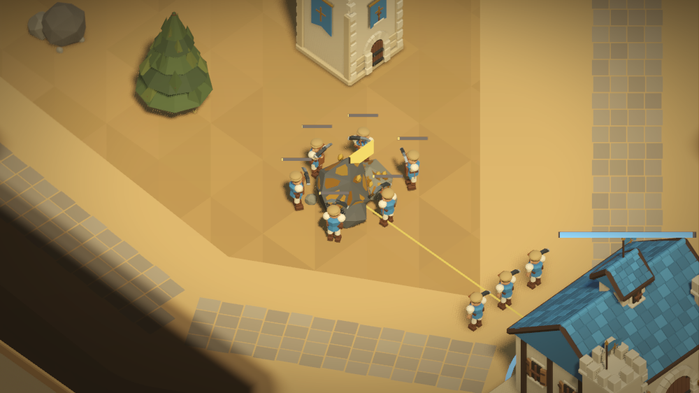

# 0.8.1：低攻击长交战、无残影与贴矿采集

本版军事单位生命沿用 0.8.0，以降低基础攻击和类别附伤延长交战；农民单独由 75 提高到 150 生命。完整数值、36 个单位对位的全部 16 种攻防组合、科技收益和实际投石采样见 [数值审查](../report/balance-0.8.1.md)，机器数据见同目录 JSON。

## 战斗与科技

| 单位 | 生命 | 基础攻击 | 近甲 / 远甲 | 类别附伤 |
| --- | ---: | ---: | --- | --- |
| 剑士 | 100 | 4 | 2 / 0 | 骑兵 +18 |
| 弓箭手 | 60 | 9 | 0 / 3 | 无 |
| 骑士 | 120 | 7 | 2 / 6 | 弓手 +3、攻城器 +13 |
| 投石车 | 160 | 18 | 0 / 4 | 剑士 +6、建筑 +50 |
| 加农炮 | 200 | 46 | 0 / 6 | 建筑 +150 |
| 农民 | 150 | 3 | 0 / 0 | 无 |

投石半径 3 内均为满伤，保留可躲避落点与无友军伤害。无科技对剑士每发 24，需要 5 发；对弓手 15，需要 4 发。全部科技组合下均至少 4 发。炮镜像每发 40，双方无科技或同级科技均需 5 发。大本营攻击降为 10，箭塔为 14，避免基地防御火力保持旧击杀速度。

攻击科技总加成仍为 +1/+2/+4，防御改为 +1/+2/+3，研究费用与时间不变。玩家状态直接读取相应科技资源，HUD 与战斗不再依赖一份共享的硬编码数组。一级攻击使剑士互砍伤害由 2 提高到 3；一级防御使弓手承受骑兵击杀的命中次数由 6 增加到 7。

这套数值存在明确取舍：剑士无科技镜像需要 50 刀，零攻击科技弓手打满防骑士只有 1 点保底伤害；10 护甲建筑使剑士、骑士即使满攻击科技也只打 1 点，需要攻城器拆楼。完整报告列出了这些边界，不能将静态克制表等同于同成本胜率。

## 残影与阵营颜色

删除旧建筑记忆模型、缓存、场景节点、小地图记忆标记和网络 `fog.buildings` 字段。地形探索记录、队伍共享视野及核心全失后的真实建筑暴露保留。旧记忆模型直接使用原模型蓝色顶点色，未应用阵营涂装，是阴影中敌方建筑变蓝的原因；真实建筑进入视野时仍按本地玩家关系着色。

客户端收到最新完整快照时立即移除已消失实体、取消选中并停用碰撞，同时清理旧插值帧中的实体索引。插值继续平滑存活单位的位置，不再把已消失目标重新显示出来。

## 采矿接近

旧六槽采集点距矿中心 3.65，允许距目标 0.65 开挖。现按实际矿石轮廓将原生 Marker 收至约 1.76～2.54，开挖容差为 0.16。模型、真实碰撞和供大型军队使用的导航安全宽度保持一致；农民从导航末点通过原生 CharacterBody3D 碰撞安全地完成短距离接近。

60°矿脉复测还发现导航末点与采集点之间的停止死区：农民离路径末点不足 0.1 时速度归零，但离采集点仍有约 0.245，导航没有标记完成。现识别原生路径的真实最后一点并完成接近，避免隔空挥镐或停在原地。

真实六人采集画面：

## 发布与验证范围

当前远程中继保持 **0.8.0 / 协议 5**，已核对在线文件与当前可玩包一致，服务处于运行状态、没有重启；本轮未中断正在使用的版本。下一版为独立的 `AshenCrown-0.8.1-Windows-x64.zip`，采用 **协议 6**，可先单机体验，须与中继一起升级后才能联网，不与旧版混用。

已按先交付包、后验证的顺序执行。验证覆盖真实 PCK 资源、原生攻击与投石落点、生产科技、六客户端本地及受损网络、迷雾移除与颜色、矿位与实际采矿。PCK 的 `--network-smoke --catalogue-only` 只读取资源，不连接或占用线上房间。

最终发布包完整 1v1 复测自然结束于 988.27 秒，26 项通过、无引擎错误；首次交战为 48.03 秒。另一次修正前样本在 625.07 秒结束。另一个样本在旧 1200 秒观察上限仍在持续交战（293 名军事单位阵亡），因此不能把单次完成对局当作固定时长保证；验收观察上限改为 1800 秒，不改变正式游戏胜负规则。Godot 导航与物理不采用确定性锁步，同一随机种子也不保证对局重放一致。

未重新进行图形帧率压测，本次无稳定 60 FPS 的新结论。旧 `unit_motion_timing_test` 使用缺少现代接口的历史 host，直接运行失败；未扩大修改该旧 fixture，本次采集时钟由真实主场景的 30/60 TPS 专测验证。

最终校验数量、版本包 SHA-256、进程清理结果和验证限制记录于 [验收数据](release-0.8.1-validation.json)。
