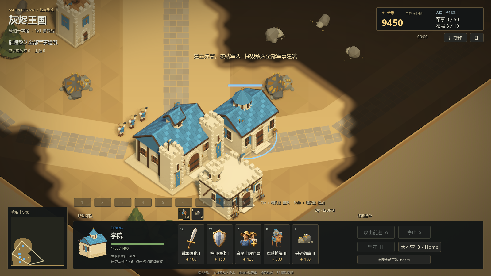

# 0.8.2：追击出手、军队扩编与采矿效率

本版保留 0.8.1 的战斗数值、攻击间隔和动画出手关键帧，修复持续追击时无法出手，并新增两条学院研究路线。全部单位的 576 项攻防科技组合、建筑伤害及经济收益见 [完整数值报告](../report/balance-0.8.2.md)，原始计算结果保存在同名 JSON 中。

## 追击为什么会停在攻击距离之外

原逻辑为目标的旧位置计算带停靠间距的导航终点。持续后撤的目标在下一次寻路前已经离开，追兵不断抵达过时的终点，却还差一点进入攻击范围。原生平地复现中，骑兵追赶弓手 8 秒没有开始一次攻击。

修复把导航接敌、攻击前摇和冷却分开负责：

- 接敌沿用原生导航和共享寻路预算，根据目标实际移动预测最多一个重规划间隔的位置。预测不参与伤害计算。
- 近战前摇期间仍可继续追步。原 `AttackWindup` Timer 和攻击冷却分别掌握唯一的出手时间与下次攻击机会，导航和重复命令不会重启它们。
- 远程进入足以完成原前摇的距离后停步瞄准；只用径向运动计算这个窗口，不把横向绕圈误认为后撤，也不把撞墙后的移动意图当成实际后撤。
- 出手时重新检查目标的存活、当前共享视野和真实距离。远程严格使用射程与最小射程，近战仅保留 0.2 世界单位的固定步接触误差；移除旧的通用 1.4 单位射程延伸。更快目标仍然能实际逃离挥砍。
- 移动、停止、坚守、换目标及死亡统一取消尚未出手的攻击并释放目标引用，已消耗的冷却保留；已经发射的弹丸继续按既有规则结算。

这套结构同时用于剑士、弓手、骑兵、两种攻城器和农民的显式攻击。冷却、速度和伤害均未提高。回归包含 30 / 60 TPS 的持续追退、切向移动、墙体阻挡、最小射程、重复命令、取消、视野变化与对象释放，具体实测保存在 [验收记录](release-0.8.2-validation.json)。

## 学院新增研究

| 科技 | 本级金币 | 研究时间 | 完成后总效果 |
| --- | ---: | ---: | --- |
| 军队扩编 I | 500 | 30 秒 | 军事人口 50 → 75 |
| 军队扩编 II | 500 | 30 秒 | 军事人口 75 → 100 |
| 采矿效率 I | 50 | 15 秒 | 采矿效率 +10% |
| 采矿效率 II | 150 | 25 秒 | 采矿效率 +20% |
| 采矿效率 III | 300 | 35 秒 | 采矿效率 +30% |

军队扩编增加的是人口点数，剑士/弓手各占 1、骑士占 2、攻城器占 3；在场与排队预留人口一起计入。农民独立上限仍为 10，已有农民上限科技可提升至 12。

采矿升级按累计倍率 1.1 / 1.2 / 1.3 推进工作，不做复利叠加。每次结算仍为 4 金，周期从基础 3 秒缩短到约 2.727 / 2.5 / 2.308 秒。升级时保留已完成的工作，固定逻辑步的小数余量带入下一次结算。自然收入保持每秒 1 金，矿脉仍为全场共享的六个工作位置。

两条路线遵循现有学院队列：逐级研究、可预订后续等级、跨学院禁止重复、取消全额退款、取消前置会连带退款后续项目。学院被毁丢失未完成研究，已完成科技永久保留。Bot 使用相同价格和队列，临近人口上限时准备扩编，有六名以上农民和可用军队后再用余钱研究采矿。

学院面板使用已有游戏模型展示骑兵与矿石，继续显示快捷键、费用和研究格子。顶部人口及选中农民/矿脉的周期读取本玩家实际科技，联机不会暴露敌人的经济升级。

## 联机与交付

新版本为 **0.8.2 / 协议 7**。玩家只收到自己的两项新科技等级；升级仍由房主验证和完成，伪造价格、等级或完成结果不能修改权威状态。命令数量按实际人口上限验证，最多支持一名玩家的 100 个轻型军事单位与 12 名农民同时下令。

六人全部扩编后的 672 单位及建筑快照已增加容量验证。解码实体上限为 1536，基础值预算为 65536，单包仍限 512 KiB，玩家命令仍限 4 KiB。容量测试不是实际网络吞吐或帧率承诺，图形性能单独记录。

### 实际性能限制

RTX 3080 / i9-10900KF，Forward+、1600×900、解除帧率限制，保留用户编辑器和后台进程。每阶段采样 15 秒，原生地图、模型、阴影、迷雾、导航、采集与实际攻击继续运行；关闭 Bot 和自然收入固定参战数量，仅以测试用百倍生命阻止单位减少。

| 场景 | 平均 FPS / 实际 TPS | 显示帧 P95 / P99 | 逻辑回调 P95 / P99 | 引擎完整物理监视器 P95 / P99 |
| --- | --- | --- | --- | --- |
| 204 人混编 | 76.71 / 29.99 | 33.399 / 38.610 ms | 12.354 / 14.349 ms | 20.690 / 20.690 ms |
| 672 人极限 | 2.42 / 19.40 | 447.327 / 450.418 ms | 38.912 / 42.101 ms | 62.002 / 62.002 ms |

**672 人明显超出现阶段流畅运行预算，204 人也未达到稳定 60 FPS。** 流程测试通过意味着未崩溃、未发生实例容量错误并完成采样，不代表性能目标通过。满规模逻辑和物理超过每步 33.3 ms 预算，不能依靠插值补足实际模拟吞吐。后续优化重点是拥挤场景的邻居查询、避让和碰撞开销，以及屏幕内军队的渲染成本，需要分别测量后优化。

显示帧数据为墙钟间隔，不是独立 GPU 计时；逻辑仅测 SceneTree 回调，引擎物理监视器包含更多物理工作但数值经过缓存。最大场景只有 37 个显示帧，P99 是短样本估计。没有宣称独占 GPU、含六客户端/Bot 的完整负载，或相对旧版的性能变化量。完整采样保存于验收 JSON 的 `performance` 字段。

独立包为 `builds/AshenCrown-0.8.2-Windows-x64.zip`。按要求先提供试玩包，再执行正式回归；随后将边缘修复重新写入同名包。当前线上中继保留 0.8.0，本轮没有重启或部署线上服务。0.8.2 可先单机体验，联机需后续同步升级中继，不能与旧版混用。

验收、包指纹、完整对局、六客户端延迟/丢包/重连以及辅助进程退出记录见 [机器验收记录](release-0.8.2-validation.json)。原始战斗计算和各项经济收益可从数值报告中的命令重新导出。
