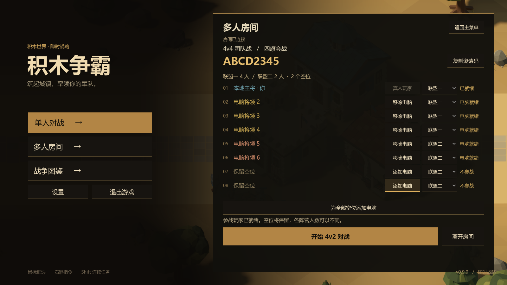
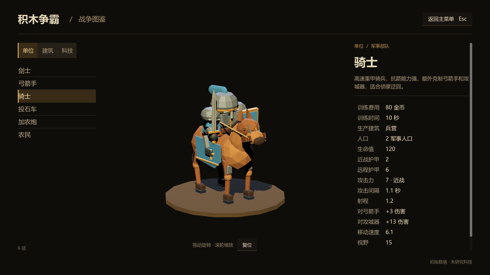

# 积木争霸 0.9.0

本版将游戏、Windows 程序、大厅、战场界面、图鉴、诊断工具、中继身份及公开仓库统一更名为“积木争霸”。仓库为 [wanheng20031114/jimu-zhengba](https://github.com/wanheng20031114/jimu-zhengba)，保持 public。旧版历史报告保留当时的包名、日志和校验值；旧名在运行代码中仅用于设置和服务迁移。

## 对局与房间

- 新增 **4v4**“四旗会战”（192×184）及 **八人乱战**“落冠荒原”（192×192），保留 1v1、2v2、3v3、2v2v2。
- 允许空位开局，例如 **4v2、3v1、三人乱战**。队伍人数不必相等，但不能超过模式容量，至少有两个实际阵营。
- 空位使用完整席位数组中的稳定索引，不生成资产、金币、视野或 Bot，不参与胜负和断线接管；中间空位不会改变末席玩家的身份。
- 房主可以逐席添加或移除 Bot，也可以主动补齐全部空位；全部真人准备后开局。每个实际参战者仍有大本营、左侧矿旁免费防御塔、3 农民与 320 金币。
- 大厅显示实际阵营人数、空位、准备情况与开局条件；例如主按钮显示“开始 4v2 对战”。常用桌面分辨率完整显示八席，小窗口保留滚动。
- 创建、加入、取消、重试与场景载入失败能返回明确反馈；正常房间操作的拒绝不再累计恶意消息次数。网络频率、身份和格式限制保留。



## 主菜单与战争图鉴

主菜单沿用游戏原生 3D 城镇和暖砂岩、蓝屋顶、炭黑金色风格，保留清晰的单人、多人与图鉴入口，以及设置、退出操作。单人模式选择在独立面板中完成。

战争图鉴包含 **6 种单位、5 种建筑、12 项科技**。拖动可旋转真实游戏模型，滚轮缩放；显示费用、生产建筑、训练时间、双护甲、攻击与类别加成、射程、视野、科技前置和研究后总效果。数据直接读取当前 Resource。关闭图鉴即停用预览渲染与模型处理。



首次以新名称启动时，仅迁移旧版显示、声音、镜头、热键和房间偏好；已有新版配置不会被覆盖，不复制旧日志或联机身份。

## 网络与验证

客户端版本 **0.9.0**、协议 **8**，最多八名真人。八阵营拥有独立敌我物理层，ENet 使用十个通道，保留 30 TPS 房主权威模拟、各收件人 15 Hz 可见快照、120 ms 展示插值和证书验证。

已完成的八客户端本地、丢包及重连检查见 [网络验收](../report/network-0.9.0.md)；地图原生检查 2,720 项通过，菜单与图鉴原生视觉回归 175 项通过，配置迁移 16 项通过。结构化记录见 [交付验收 JSON](release-0.9.0-validation.json)。

性能范围和后续设计见 [八人性能审查](../report/eight-player-performance-review-0.9.0.md)。本轮没有以降低模拟频率或改动兵种数值来掩盖重负载问题；战斗数值沿用 [0.8.2 详细矩阵](../report/balance-0.8.2.md)。

## 构建

```powershell
python tools/build_content_manifest.py
powershell -NoProfile -ExecutionPolicy Bypass -File tools/build_windows.ps1 -VersionedOutput 0.9.0
```

输出 `builds/积木争霸-0.9.0-Windows-x64.zip`，完整解压后运行 `windows/积木争霸.exe`。目录中同时保留 PCK、玩家说明和诊断工具。所有联机玩家需要一起更新，旧版本无法进入协议 8 的房间。

## 实际交付结果

Windows ZIP 为 **69,075,153 字节**，SHA256：

```text
b08e3cbe467bec12dc944508a847775374c77b75af47dd9adcad7e7c70542932
```

同时提供完全相同的 `builds/积木争霸-Windows-x64.zip` 最新版入口。五个 ZIP 条目与解压目录逐字节一致，中文文件名使用 UTF-8；Windows 产品名称“积木争霸”、文件版本 `0.9.0.0` 已核实。PowerShell 诊断脚本包含 UTF-8 BOM，已在 Windows PowerShell 5.1 实际运行并识别新 EXE/PCK。发布日志持久化 11 项通过。

上海已部署 `jimu-zhengba-relay.service`，发布标识 **`6fad90dfc2bf38b3`**，UDP **24571**。服务 active/running，自动重启次数 0；远端 93 项资源清单与本地一致。原本游戏服务已停用，另一个应用的 UDP 24570 服务保持原 PID **270544**。更名部署的失败回滚会停止并撤销新服务首次启用，再恢复原服务，避免自动重启或开机竞争端口；部署与回滚检查 13 项通过。

实际 Windows 程序分别连接上海服务验证 **4v2（空席 5、6）**与**八人乱战**，各 **182 项通过**。包括受信证书、版本与资源清单、模式、地图、席位阵营、空位、开局、结算和房间释放。两次握手为 553 / 539 ms，属于该次观测，不代表长期延迟指标。

发布包完整 Bot 对局没有补钱、改伤害或强制结算；以 10 倍墙钟速度运行，逻辑步仍为 1/30 秒。

| 对局 | 验收 | 游戏内时长 | 首次造成伤害 | 伤害事件 / 军事阵亡 | 结果 |
|---|---:|---:|---:|---:|---|
| 4v2，保留中间两个空席 | 54 项通过 | 367.47 秒 | 61.03 秒 | 1,009 / 75 | 联盟一通过清建筑自然获胜 |
| 八人乱战 | 62 项通过 | 886.40 秒 | 49.03 秒 | 3,874 / 444 | 第六席阵营最终获胜；房主提前出局后对局继续 |

两个程序均正常退出，stderr 为空。网络协议八客户端测试与上述发布包完整对局是不同的验证场景，不把 Bot 完整对局表述为公网八真人实战。

## 性能边界

RTX 3080 / i9-10900KF、Forward+、1600×900、关闭其他验证程序后采样；保留用户编辑器。每阶段 15 秒，真实模型、采矿、攻击、导航、迷雾与阴影开启，关闭 Bot 和联网以固定样本规模，测试专用百倍生命防止人口下降。

| 实际单位数 | 平均 FPS | 实际 TPS | 显示帧 P95 / P99 | 逻辑步 P95 |
|---|---:|---:|---:|---:|
| 272，八方标准混编 | 81.55 | 29.98 | 40.946 / 44.172 ms | 12.007 ms |
| 896，八方升级后满轻兵 | **1.94** | **15.52** | **545.735 / 549.317 ms** | **49.034 ms** |

**八人满人口未达到流畅运行要求，标准混编也存在长帧，不能宣称稳定 60 FPS。** 极限场景每显示帧执行 8 个逻辑步，寻路查询中位数及 P95 打满每步 24 次。固定模拟积压和寻路开销有实测证据；调整帧率上限不能解决单步过贵。后续建议按命令优先级和时间预算调度寻路、按所有者维护索引、减少纯表现更新和重复快照提取，具体位置、风险与尚未实施的范围均写在 [性能审查](../report/eight-player-performance-review-0.9.0.md)。

## 清理范围

辅助测试程序在各自运行器中关闭，并另以 Windows 进程命令核实；当前仅保留用户正常编辑器 PID 33896。本地验证辅助 Godot 进程为 0，生产中继按交付要求持续运行。

主代理的 19 个脚本和日志中间文件已删除并核实不存在。另两组原生 PowerShell 清理被自动审批以 `blocked by policy` 拒绝：网络代理的 326 个文件（约 6.14 MiB），以及界面代理的 19 个中间截图与日志；合计 **345 个文件暂时保留**。被拒绝的删除未执行，也未改用其他方式重试。它们位于已忽略的 `.local/network` 和 `artifacts`，不进入公开仓库与发布包。精选 `report` 截图、生产密钥、公开证书备份和运行时缓存继续保留。
