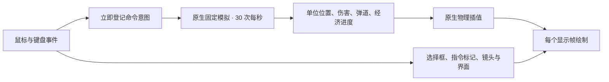

# 固定模拟与流畅显示

本文保留早期模拟架构实施记录，其中即时招募、旧采矿金额、增援与移动尘土描述不代表 0.7.0 的现行规则。当前训练与经济见 [生产与科研队列](production-queues.md)、[训练节奏与建筑出场](rts-economy-placement.md)，联网边界见 [0.7.0 联网验收](network-validation-0.7.0.md)。

游戏使用 Godot 的原生固定物理步作为战斗时钟，默认每秒 30 次；显示帧率独立。移动、避让、攻击判定、弹道和劳动进度读同一份模拟状态。相机、选择反馈、建造预览和界面不等待下一次模拟步。

## 时钟与状态归属

| 内容 | 更新方式 | 约束 |
| --- | --- | --- |
| 作战时间 | `game._physics_process` 中的 `simulation_tick` / `elapsed` | 暂停或结束后停止推进 |
| 行走、RVO 避让与碰撞 | `BattleUnit._physics_process`、原生 NavigationAgent3D 与 CharacterBody3D | 共用物理步长，不能另用低频 Timer 调用 `move_and_slide` |
| 索敌、追击重寻路 | 固定步内的错峰倒计时 | 约 0.3–0.4 秒检查一次；每个移动物理步只更新一次路径位置 |
| 攻击与射击 | 固定步冷却、物理回调的 AttackWindup Timer | 释放前重查目标；重复同目标命令保留前摇 |
| 采矿、施工 | 工人在物理步内贡献时间 | 每 3 秒结算 3 金币、累计施工 20 秒；保留周期余数 |
| 基础收入与敌方增援 | 原生 Timer，`process_callback = PHYSICS` | 不随显示 FPS 改变频率 |
| 镜头、拖选、建造预览、指令标记 | 输入回调或 `_process`，关闭该显示分支的物理插值 | 下一显示帧就能回应鼠标，不额外等待 33 毫秒 |
| 信息栏与单位肖像 | 信息栏定期刷新并在操作后立即刷新；活动肖像 15 FPS | 静止肖像缓存，避免重复渲染 |
| 移动尘土 | 常驻 GPUParticles3D，30 FPS 粒子模拟及原生显示插值 | 按实际移动发射，停止、受阻或死亡后已有粒子自然散去 |

用户命令立即改变“下一步要做什么”，并显示标记或音效；它不在输入回调中逐帧移动部队或结算一次攻击。选择和编队保留即时反馈。即时招募、工地占地与金币扣除是原子操作，立即完成登记；新实体设置好位置后重置插值，避免从世界原点飞入画面。

## 时间精度

30 次/秒模拟意味着每步约 33.33 毫秒。冷却不是简单到零后重新赋完整时长，而是在持续交战中带入越过零的余数。例如 1.05 秒攻击间隔由相邻 31/32 个物理步表示，长期频率不会因每次向上取整而变慢。已经待命的单位不会累计“欠下的攻击”后突然连续出手。

攻击、采集和建造使用秒计时，改变测试 TPS 不修改单位属性。显示插值只平滑画面，不参与射程、碰撞或经济计算。位置绘制会保留约一个固定步的插值历史；镜头和指令反馈不加这段等待。减少模拟频率与降低玩家看到的显示帧率是两件事。

掉帧补步交给引擎处理，保留原生每显示帧最多 8 个物理步的上限，不用无上限 `while` 循环追赶时间。严重超载时模拟可能减速；不会一次补发大量攻击或根据系统墙钟补算暂停期间的金币。30 TPS 是本项目的起始折中，未来调整频率要同时复测导航、攻击节奏与显示质量。

箭弹在命中物理步只结算一次伤害，终点姿态保留到下一步再回收，让显示完成最后一段插值。单位出生、建筑放置和弹丸初始化后调用 `reset_physics_interpolation()`；死亡倒地、建筑倒塌的变换 Tween 使用物理时钟。

原生单位动画也在物理步推进；出手时先保证武器已经到达作者定义的释放姿态，再读取挂点创建弹丸。动作只保存一份关节状态，射击挂点不会受显示 FPS 影响。停止订单在当前调用内停发尘土并切回待命动作，因此战斗结束或退出关闭物理回调后不会原地行走、持续扬尘；已经发射的粒子继续自然散去。

## 结构优化

自然障碍以 73 个独立 StaticBody3D 保存，每个物体有一个无局部变换的碰撞形状，避免把全地图分散岩树归入同一大碰撞体。导航网格仍离线制作；防御塔改变占地时筛选缓存多边形，不每帧重新烘焙。

正交镜头使用单张 4096 阴影图，镜头远裁剪设为 110 米。当前镜头最大缩放下，可见地面深度仍有余量；覆盖范围通过原生投影射线及实际模型包围盒检查。保留原来的抗锯齿、环境遮蔽、间接照明和阴影滤波设置。

单位选中圈共用不透明 ShaderMaterial，以实例参数区分阵营色。原代码在运行时已经将圈的 Alpha 设为 1；现在避免为实心圈保留每单位独立的透明材质。血条继续使用原来的穿透遮挡显示方式。

## 验证与进一步扩展

`unit_motion_timing_test.gd` 比较 30/60 TPS 下的一分钟攻击次数和采矿收益；`fixed_step_contract_test.gd` 验证暂停、基础经济、工作边界及物理步之间的即时反馈。`physics_interpolation_visual_test.gd` 使用真实渲染器检查插值和攻击释放，`shadow_camera_audit.gd` 检查缩放、超宽比例及地图边角。

`stress_test.gd` 允许在测试中传入 `--tps=60` 等参数，输出 TPS、窗口尺寸、FPS、P95/P99 和原生性能监测，比较必须使用相同分辨率、部队规模和场景。无头测试适合规则验证，不能作为实际游戏帧率。

这套结构复用引擎的固定时钟，没有再包一套自定义物理调度器。若以后引入联网或回放，需要在命令意图入口增加 tick 编号、序号和序列化，并单独验证随机数与跨平台确定性；现有单机 Jolt/RVO 的运行结果不能直接视为网络锁步协议。

参考：[Godot 物理插值](https://docs.godotengine.org/en/4.6/tutorials/physics/interpolation/using_physics_interpolation.html)、[相机与显示分支](https://docs.godotengine.org/en/4.6/tutorials/physics/interpolation/advanced_physics_interpolation.html)、[物理频率与补步上限](https://docs.godotengine.org/en/4.6/classes/class_engine.html#class-engine-property-max-physics-steps-per-frame)、[3D 碰撞形状性能](https://docs.godotengine.org/en/4.6/tutorials/physics/collision_shapes_3d.html)、[自动实例化](https://docs.godotengine.org/en/4.6/tutorials/performance/optimizing_3d_performance.html#use-automatic-instancing)。
