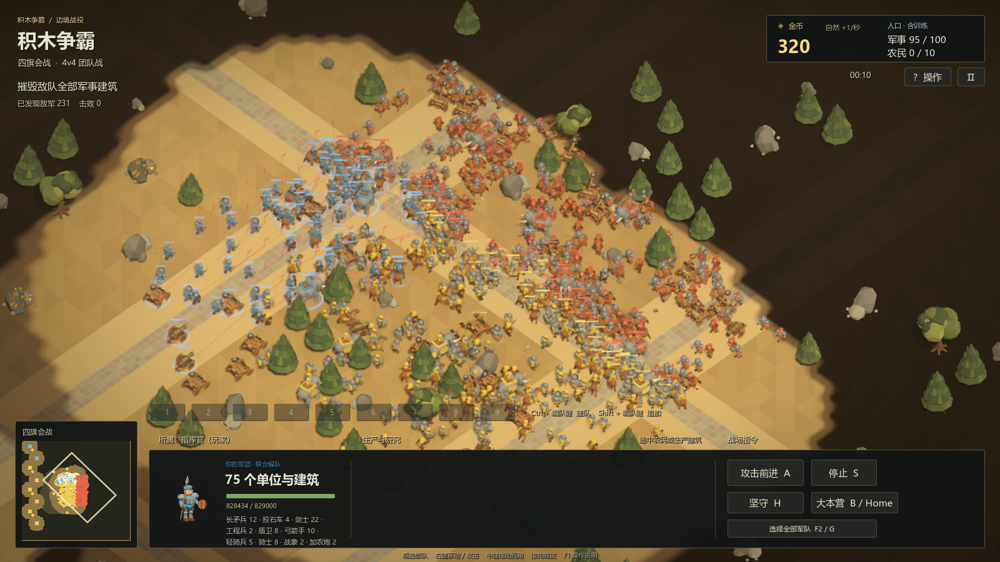

# 600 单位战斗性能基线

当前版本未通过 600 单位可玩性验收。在本机的真实 Release 渲染测试中，600 个混合单位持续交战为 **7.95–10.04 FPS**；600 骑兵为 **3.02 FPS**，模拟也降至 **24.20 TPS**。可以继续发送命令，但后者的画面与操作反馈已有明显停顿。

## 测量条件

2026-09-13，i9-10900KF、RTX 3080、64GB 内存，Godot 4.6.3 官方 Windows Release 模板，Forward+ / Vulkan，1600×900。运行时核实 `debug_build=false`、`editor_feature=false`。30 TPS、最多每显示帧追赶 8 步、物理插值、4× MSAA、TAA、阴影、迷雾、真实动画、攻击、音效及碰撞全部保留；只在测试进程解除 VSync 和帧数上限。

四场有效测试使用同一冻结 PCK，SHA-256 为 `d9793d8e108679d40960cebd32e2cff37fee18508d9079705139fb181afef0af`。源码基于 `3f6fc5c9ff51cdf5762bb8a54f922fd04ebf7ede`，包含冻结时已有的本地资源修改；逐文件指纹见同名 JSON，不能将它描述为该提交的纯净检出。

使用原生 4v4 地图，八方各 75 单位、双方各 300，总计 600。混合阵容每方：22 剑士、12 长矛兵、8 盾卫、10 弓箭手、8 骑士、5 轻骑兵、4 投石车、2 加农炮、2 战象、2 工程兵，军事人口 95/100。纯骑兵每方 38 骑士、37 轻骑兵。保留地图总部和防御塔，停止 Bot 战略决策与自然收入，没有采矿农民或联网客户端。

每场预热 6 秒，记录下令开战 5 秒、持续交战全景 30 秒、拉近镜头并改令 20 秒。全景使用正常最大缩放 62，近景为 37，持续阶段另记实际可见人数。三个固定人口样本仅把生命值与生命上限乘 100，以维持 600 个存活单位；攻击伤害、频率、碰撞、寻敌、维修和特效照常。另跑一场正常生命值战斗，明确记录死亡后的负载下降。

用户编辑器保持运行。每 5 秒观察一次其他 Godot 测试，四场均未发现并发辅助测试。这不是独占工作站，也不代表最低配置、八人联网或完整 Bot 对局的性能承诺。

## 实测结果

| 场景 / 阶段 | 起止存活数 | 平均 FPS | 帧耗时 P95 | 最长帧 | 实际 TPS |
|---|---:|---:|---:|---:|---:|
| 混合 A：下令开战 | 600→600 | 23.99 | 74.79 ms | 97.27 ms | 29.79 |
| 混合 A：持续全景 | 600→600 | 10.04 | 127.81 ms | 179.30 ms | 30.16 |
| 混合 A：近景操作 | 600→600 | 9.82 | 133.01 ms | 203.62 ms | 30.27 |
| 混合 B：下令开战 | 600→600 | 23.77 | 77.28 ms | 106.06 ms | 29.71 |
| 混合 B：持续全景 | 600→600 | 7.95 | 214.16 ms | 312.23 ms | 30.08 |
| 混合 B：近景操作 | 600→600 | 10.00 | 131.78 ms | 206.84 ms | 30.26 |
| 骑兵：下令开战 | 600→600 | 10.32 | 261.79 ms | 308.11 ms | 27.97 |
| 骑兵：持续全景 | 600→600 | 3.02 | 358.79 ms | 372.48 ms | 24.20 |
| 骑兵：近景操作 | 600→600 | 3.08 | 336.51 ms | 361.17 ms | 24.65 |
| 正常生命：下令开战 | 600→586 | 23.72 | 74.26 ms | 107.82 ms | 29.69 |
| 正常生命：持续全景 | 586→185 | 49.17 | 64.71 ms | 195.27 ms | 30.23 |
| 正常生命：近景操作 | 185→75 | 187.33 | 11.04 ms | 31.73 ms | 30.20 |

TPS 是有限墙钟窗口内实际步数的比值，边界附近追赶积压可使窗口值稍高于 30；未加速游戏时间。纯骑兵全景的每个显示帧均执行 8 步，已碰到追赶上限，模拟速度约为正常的 80.7%。提高追赶上限不能降低单步成本。[Godot：物理频率与追赶步数](https://docs.godotengine.org/en/4.6/classes/class_engine.html#class-engine-property-max-physics-steps-per-frame)

固定人口样本的每秒检查均为 600 存活。混合 A 全景可见 525–600，骑兵全景可见 587–600；单位确实在移动和交战，混合 A 全景发生 6,866 次伤害，骑兵全景 2,773 次。正常生命值后半段的高帧率对应显著减少的人数，不能用于宣称 600 单位流畅。



## 操作响应

从真实命令总线提交改令，到下一个观察到命令已消费、部队开始位移的帧：混合 A 已完成的 7 次为 93.6–135.5 ms，混合 B 的 8 次为 96.7–116.0 ms，骑兵的 7 次为 313.5–342.0 ms。镜头输入的平均观察响应分别为 106.4、103.2、323.5 ms。

这是合成输入到游戏更新帧的延迟，不包含鼠标硬件、操作系统输入排队和显示器扫描。混合 A 最后一次命令落在采样结束边界，原始值保留为 `-1`，不计为 0 ms 或已完成响应。开场给全部八军下令后，各军的待处理路径全部清空最迟约 0.84 秒；攻击追击可转入直接转向，因此此值不是 600 次 A* 的耗时。

## 已定位的边界

| 持续全景指标 | 混合 A | 骑兵 |
|---|---:|---:|
| 场景树物理回调，平均 / P95 | 19.74 / 23.80 ms | 见原始 JSON / 34.72 ms |
| 引擎物理监视值，采样均值 | 30.40 ms | 45.65 ms |
| 原生路径查询，每步均值 / P95 | 0.057 / 0.358 ms | 0.770 / 1.541 ms |
| 主视口 GPU，平均 / P95 | 8.80 / 25.03 ms | 见原始 JSON / 27.64 ms |
| 每显示帧实际物理步数，均值 | 3.00 | 8.00 |

这些值指向模拟与 CPU 侧工作接近或超过预算；路径搜索本身不足以解释持续交战的整帧卡顿。GPU 仍有可观成本，尤其不能把 P95 超过 16.7 ms 的 GPU 样本称为“没有负载”。需要进一步把碰撞移动、寻敌、RVO、动画、模型变换提交和投射物逐项计时。

场景树优先级探针只覆盖物理回调，不覆盖其外的 PhysicsServer 工作。引擎 `Performance` 监视值存在缓存；主视口 CPU/GPU 时钟也只代表其各自边界，不能把所有列简单相加。[Godot：Performance](https://docs.godotengine.org/en/4.6/classes/class_performance.html)、[RenderingServer 计时](https://docs.godotengine.org/en/4.6/classes/class_renderingserver.html#class-renderingserver-method-viewport-get-measured-render-time-cpu)

## 验收与复现

本轮预先设定的基本门槛为平均至少 30 FPS、帧耗时 P95 不超过 50 ms、至少 29 TPS、无超过 250 ms 的帧。三个持续 600 人样本均未通过。四场共 2,596 项夹具与数据完整性检查、零失败，只说明证据完整，不代表性能达标。

首个准备包缺少主场景，未进入游戏。随后首轮布阵投影异常、出现大量重叠且最终只剩 598 人，已排除，不用于上表。有效夹具等待实际可招募位置、校验脚下通行空间、单位间距和出生坐标，再开始采样。

构建与执行入口：

```powershell
python tools/build_battle_600_benchmark.py --output .local/battle-600-new
./tools/run_battle_600_benchmark.ps1 -Executable .local/battle-600-new/bin/battle-600.exe -OutputDirectory .local/battle-600-results -RunId mixed-a
./tools/run_battle_600_benchmark.ps1 -Executable .local/battle-600-new/bin/battle-600.exe -OutputDirectory .local/battle-600-results -RunId cavalry -Cavalry
./tools/run_battle_600_benchmark.ps1 -Executable .local/battle-600-new/bin/battle-600.exe -OutputDirectory .local/battle-600-results -RunId natural -NaturalHealth
```

构建脚本冻结当前资源、复用导入结果的独立副本，用官方导出器生成独立 PCK；不会改写正常项目配置与发行包。不得添加 `--fixed-fps` 或用无头帧率替代上面的渲染测试。四场有效运行均已正常退出，辅助构建进程也已退出；经命令核实，仅用户编辑器仍在运行。

完整分位数、每秒人口/可见/运动/伤害记录、命令延迟和冻结源码指纹见 [机器可读证据](battle-600-performance-2026-09-13.json)。

后续已完成 [CPU／GPU／物理／RVO 分项研究与隔离对照](battle-600-bottleneck-research-2026-09-13.md)。其中核对了原生监控范围：物理监控包含脚本和导航，导航监控又包含移动回调；两者发布的是近期窗口峰值，不能解读为纯物理引擎或纯避让算法的平均成本。
