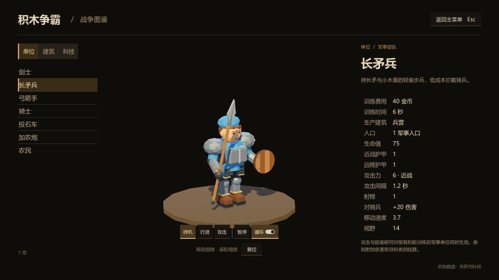
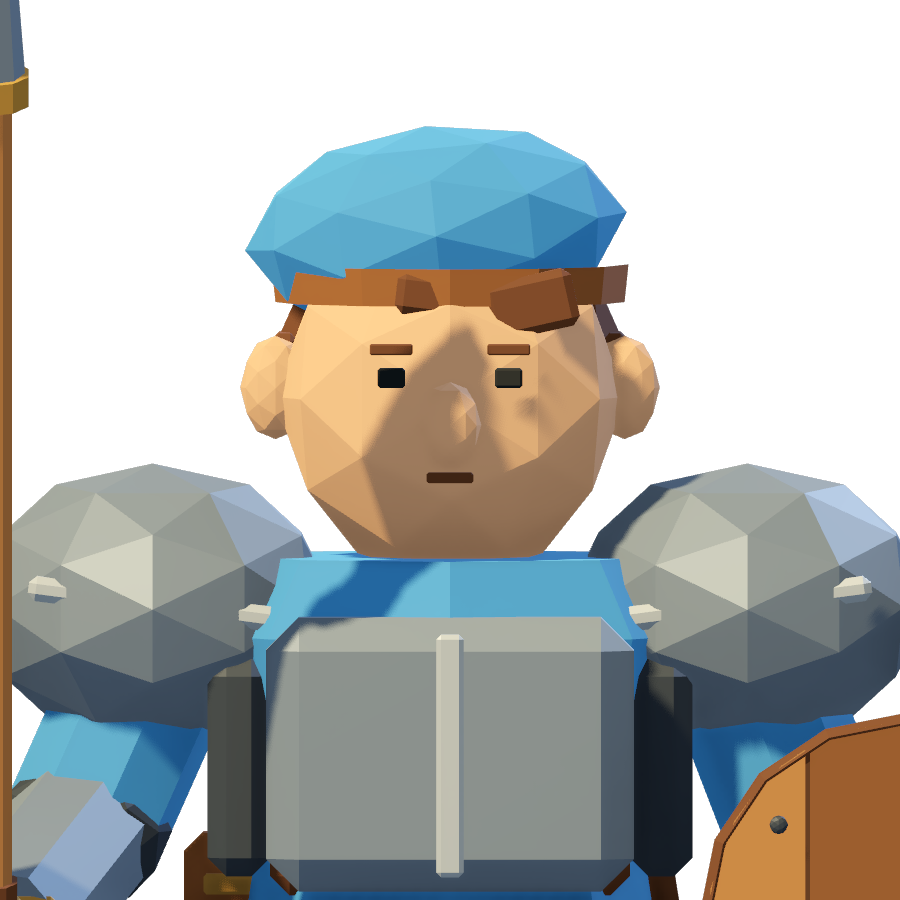
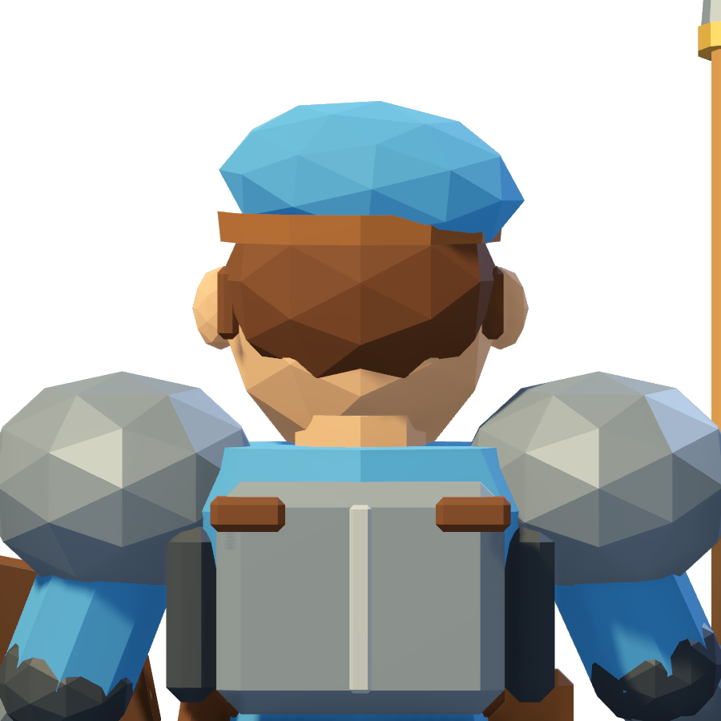
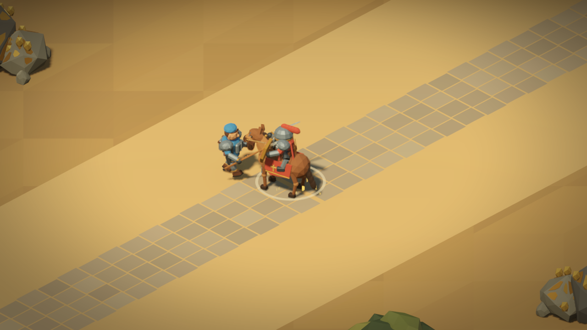

# 长矛兵外观调整与骑兵接敌修复

2026-09-11，Godot 4.6.3，修复基线为 `bd56ddc`。

长矛兵改为软布帽、可见的头发和耳朵、小木盾。身体保留肩甲、臂甲和腿甲，补上清楚可见的钢制胸甲、背甲和侧面甲片，与剑士保持同一套材质和造型比例。眉眼、鼻子和嘴整体上移，避免五官挤在下半张脸。木盾半径由 0.33 改为 0.25，采用原木板、窄皮革包边和少量铆钉。

图鉴原先选择天空环境光，但该独立预览世界没有配置天空资源，导致鼻子和帽子投下的阴影发黑。已将环境光来源改为现有的颜色和强度配置，使脸部在阴影中仍可辨认；对应 [Godot Environment 的 AMBIENT_SOURCE_COLOR](https://docs.godotengine.org/en/4.6/classes/class_environment.html#enum-environment-ambientsource)。

模型仍为 7 个刚性部件、5000 个三角形，原生 ArrayMesh 与批量渲染共用资源。关节、握矛位置、待机、行走、突刺和命中时刻保持原有结构。源模型由 `tools/build_units.py` 单独重建长矛兵，运行时没有增加节点或生成几何。上一轮确认的全部兵种数值保持不变。

接敌异常来自 `BattleUnit._chase_velocity()`：旧代码先计算当前位置的接触点，再无条件叠加目标 0.55 秒的运动预测。骑兵速度为 6.1，一次预测可平移约 3.36 个世界单位。迎面接近时，这会把步兵的追击点移到身后；移动方向又负责模型朝向，因此同时出现退步和转身。直达路径每帧更新这个目标，更容易反复震荡。原生避让收到的期望速度已经是反向的。

在真实沙盘中分别记录追击输入、原生避让输出、实际位移和模型朝向，关闭避让后仍能复现。修复前的一帧中，剑士与骑兵间距为 4.83，骑兵迎面速度约 6.09，剑士的期望速度朝后约 3.47；随后实际后退并背向敌人。这定位了追击目标计算与模型转向之间的因果关系。

修复将预测限制在剩余接触时间内：以当前间距减去双方半径和攻击站位距离，得到剩余距离；再用己方速度与目标实际径向速度计算相对接近速度。相互接近时，预测时间取接触时间与 0.55 秒中的较小值；无法缩短距离时保留原有预测上限，以支持追逃。预测后围绕新的目标中心重新计算站位方向。直达移动的最后一步按剩余距离限速，防止低物理帧率下越过站位点。

该计算适用于全部兵种，保留原生寻路、RVO、物理碰撞、建筑接触、攻城器最小射程以及攻击计时。没有添加骑兵特例，也没有裁剪避让后的安全速度。遵循 [NavigationAgent3D 的期望速度与安全速度流程](https://docs.godotengine.org/en/4.6/classes/class_navigationagent3d.html)；路径重算间隔及预算保持不变，每单位每个物理帧最多跟随一次原生路径。

以下为 12 单位初始间距、5 秒真实沙盘模拟的累计反向位移，启用原生 RVO 与直达路径。单位为世界单位，并非一次退步的距离。

| 对阵 | 物理帧率 | 修复前 | 修复后 |
| --- | ---: | ---: | ---: |
| 剑士迎战骑兵 | 30 | 2.274 | 0 |
| 长矛兵迎战骑兵 | 30 | 2.276 | 0 |
| 剑士迎战骑兵 | 60 | 1.696 | 0 |
| 长矛兵迎战骑兵 | 60 | 1.696 | 0 |

28 组迎面交战均不再产生反向追击指令，剑士和长矛兵在全部覆盖组合中的累计反向位移均为 0。农民、骑兵仍可有小于 0.024 的累计原生避让修正，低于测试中的可见退步阈值 0.05。双方均能连续启动攻击并造成真实伤害，接敌前没有背身。另覆盖 4 组真实沙盘直达追逃，长矛兵和骑兵均能命中持续撤退的目标。

| 最终检查 | 通过数 |
| --- | ---: |
| 30/60 物理帧率、直达/原生路径、避让开关、旋转方向、双方伤害与朝向、直达追逃 | 208 |
| 七兵种追逃、目标被墙阻挡、径向/切向移动、最小射程、前摇中命令与目标失效、原有攻击冷却 | 536 |
| 八阵营 24 对 24 群战、前排连续命中、友军后排压力、HOLD、通行和重新起步、锁定目标 | 152 |
| 原生场景与批量模型的变换、动画及挂点一致性 | 1829 |
| Forward+ 实际图鉴渲染、各向突刺取景、沙盘放置/选择/移动/暂停/恢复及 AI 识别 | 37 |
| 合计 | 2762 |

最终检查均为 0 失败，最终日志无脚本错误。修复前的基准检查为 84 项、50 项失败；随后扩展了新测试断言。基准轨迹片段、前后全部对阵指标及各项验证结果保存在 [validation.json](engagement-20260911/validation.json)。图像为实际 Godot Forward+ 渲染，近景及接敌截图可通过同目录 `capture_detail.gd` 重现。

可使用 `Godot.exe --headless --path . --fixed-fps 120 --script res://tests/engagement_approach_test.gd` 重跑接敌测试。追逃和群战分别使用 `tests/pursuit_attack_test.gd` 与 `tests/crowd_contact_combat_test.gd`。图鉴测试使用有图形输出的 Godot，脚本为 `tests/spearman_integration_test.gd`，`--` 后可传输出目录。

验证涵盖本地原生模拟与渲染；未以这些测试结果推断联网同步或大规模帧率表现。提交前核实并清理本任务验证进程，保留正常编辑器与工作区已有修改。
