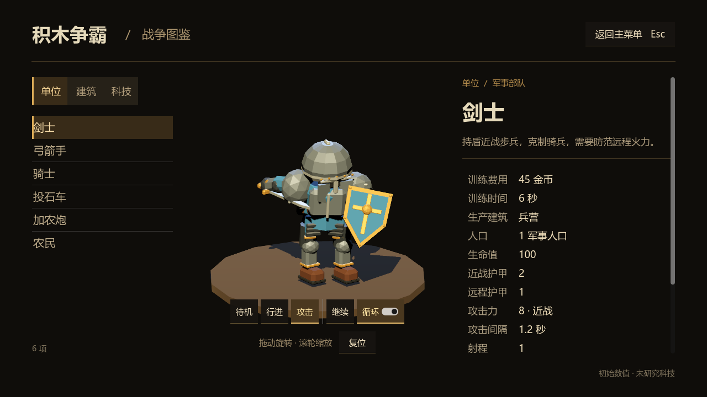
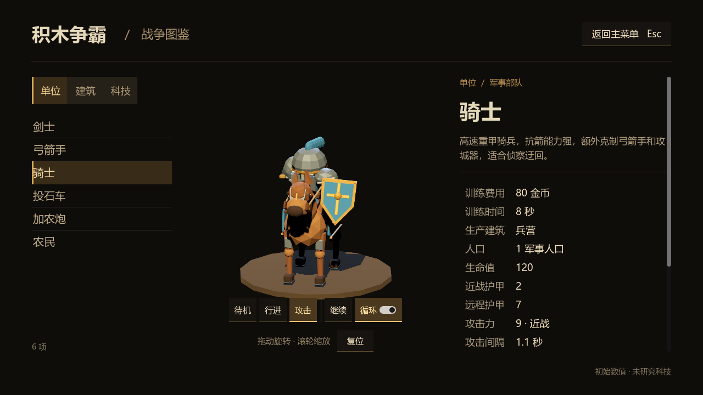
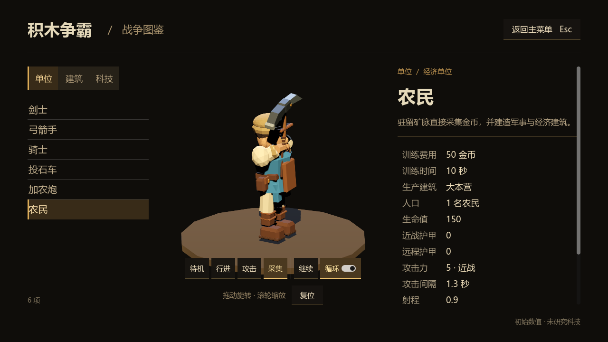

# 兵种持盾模型与百科动作预览验收

日期：2026-09-11。基于 0.12 发布后的主分支，完成六类单位的视觉检查，修正剑士、骑士持盾穿模，并为战争图鉴增加可控制的游戏内动作预览。本次交付为源代码与模型资源；现有 Windows 发行包和 Relay 服务没有更新。

## 模型调整

| 单位 | 检查结果与处理 |
|---|---|
| 剑士 | 盾面靠近身体与头部，攻击时相交。调整左臂握持结构，把盾面略向外、向前并降低，保留肩关节位置。 |
| 骑士 | 除持盾姿势外，攻击中的身体转向会把盾带入骑手和马头区域。调整左臂与盾的位置，并修正挥砍后半程的左臂朝向。 |
| 弓箭手、农民 | 检查待机、行进与攻击；农民另检查采集。保留模型。 |
| 投石车、加农炮 | 检查待机、行进、投射／开炮；保留模型外形。 |

原始模型与战场使用的批量模型同步更新。剑士动画轨迹保持原样；骑士只调整持盾左臂的部分朝向，挥砍时间、持剑右臂轨迹与伤害出手时机不变。

修改保留在可重新生成的建模源文件 `tools/build_units.py`，同时提交 GLB 源部件和原生 ArrayMesh 资源。两种单位的左臂分别增加 32 个三角形；各仍为一个材质表面，保留六级 LOD 和阴影网格，没有增加材质表面数量。

## 百科交互

在模型下方提供紧凑的原生控件：

- 所有六种单位均可切换待机、行进、攻击；投石车显示“投射”，加农炮显示“开炮”。农民额外提供“采集”。
- 支持暂停、继续、循环开关；关闭循环后，完整播放一次，随后可点击“重播”。
- 暂停后仍可拖动旋转、滚轮缩放，便于检查盾牌与身体的间距。
- 切换单位时回到默认待机状态。建筑和科技沿用静态预览。
- 动作使用游戏内原生 AnimationPlayer 片段，攻击预览保留完整动作与实际攻击周期。预览不运行战斗、采金、投射物或声音系统。

检查中还修正了攻城器从行进／攻击切回待机时保留旧轮子角度的问题：切换动作时先统一恢复攻击、行进、待机轨道的初始值，再播放选定动作。

实际鼠标检查另发现，停在“开炮”按钮上时出现的提示框会提前消费 Esc，导致按键只关闭提示而不能返回主菜单。现在百科可见时在 GUI 处理前接收返回键；设置界面开启时仍优先交由设置界面处理。

## 更新与渲染开销

百科采用单一表现时钟手动推进两个原生动画播放器。预览世界关闭物理插值，避免展示动作再次受到 30 TPS 插值影响。暂停后停止动画推进；关闭百科后停止模型处理和视口更新。暂停期间，仅旋转或缩放等操作触发单次重绘。

该实现仅作用于百科，未引入战场逐单位的新回调，也没有在本轮重复进行大规模 CPU 或联网压力测试。六类预览共用现有场景和资源；并未复制一套战斗逻辑。

## 验证证据与边界

环境：Godot 4.6.3 stable、Vulkan Forward+、RTX 3080。以 1280×720 原生 GPU 验证程序检查布局、动画和实际纹理更新；另在实际主菜单的 1920×1080 界面通过鼠标操作检查。

| 验证 | 结果 |
|---|---|
| 原生模型资源、动画与原始／批量模型一致性 | 800 项检查，0 失败 |
| 剑士盾面与身体部件相交抽样 | 73 个样本，调整前 73 个相交，调整后 0 个 |
| 骑士盾面与骑手、马头等部件相交抽样 | 72 个样本，调整前 72 个相交，调整后 0 个 |
| 其余四种单位源部件完整性 | 32 个源部件无变化 |
| 百科动作、暂停、重播、切换、布局与视口更新 | 最终 129 项检查全部通过；其中包括截图保存检查 |
| Esc 输入路径 | 15 项检查全部通过，包含真正可见的原生悬浮提示、五种控件焦点、设置与热键捕获状态 |
| 手动视觉检查 | 六种单位的待机、行进、攻击；剑士／骑士的多个旋转视角与攻击关键姿势；农民采集；实际按钮切换和暂停 |

盾牌几何检查按实际保存的攻击旋转轨迹抽样，比较主盾面和相关身体部件的保守凸包。它是辅助证据，并不等于对所有连续姿势、全部武器细节和任意镜头进行穷尽证明；已结合关键姿势的实际画面检查。

暂停检查比较实际视口纹理：不请求重绘时改变模型锚点，纹理保持相同；请求单次更新后纹理变化。没有把 `SubViewport` 的更新模式属性读数误当成实际重绘次数。

验证过程中，首次脚本对单次更新属性的断言和动画混合的时间步设置不准确，已改为实际纹理检查和 60 Hz 小步推进；随后发现并修复上述轮子姿态复位问题，最终完整检查通过。中间失败不计入通过结果。

最终实际交互再次从主菜单进入百科，选择加农炮、点击开炮、等待提示显示，再按一次 Esc，确认同时关闭百科和提示并返回主菜单；随后通过退出按钮正常结束游戏。该次运行日志没有脚本错误。

详细机器可读结果保存在 [model-codex-2026-09-11.json](model-codex-2026-09-11.json)。报告图片为 Godot 实际渲染截图，没有后期修补模型。

实现提交：`3168dff`（盾牌模型）、`584b355`（动作预览）、`82d496b`（Esc 返回）。

## 进程与临时文件

本次模型烘焙、无头验证、GPU 验证及两次实际交互验证所启动的辅助进程均已结束。最终通过 `Get-CimInstance Win32_Process` 核实，仅保留用户原有的 Godot 编辑器 PID 36624，没有遗留本任务的 headless、check-only 或验证游戏进程。

删除本次临时目录与自动生成 UID 的 PowerShell 操作被自动审批拒绝，工具仅返回 `blocked by policy`，未提供更具体原因。没有改用其他工具绕过拒绝；以下文件仍保留，未提交到仓库：

- `.local/model-codex-20260911/`：本次截图、动画验证及 `escape/` 输入验证文件。
- `.local/shield-model-fix-20260911/`：本次模型生成与几何检查文件。
- `server/relay_bootstrap.gd.uid`、`tools/build_rigid_batches.gd.uid`：本次重新导入缓存时自动生成的未跟踪文件。

这些路径均相对于项目根目录 `C:/Users/wh/Documents/middle-ages-battle`。本轮没有重试清理此前被拒绝的发布目录，也没有修改已有回退快照。

## 原生接口依据

- [Godot AnimationPlayer](https://docs.godotengine.org/en/4.6/classes/class_animationplayer.html)：播放、定位和手动推进动画。
- [Godot ViewportTexture](https://docs.godotengine.org/en/4.6/classes/class_viewporttexture.html)：读取实际渲染内容。
- [Godot 4.6 Viewport 实现](https://github.com/godotengine/godot/blob/4.6/scene/main/viewport.cpp)：单次更新模式的保存与提交行为。
