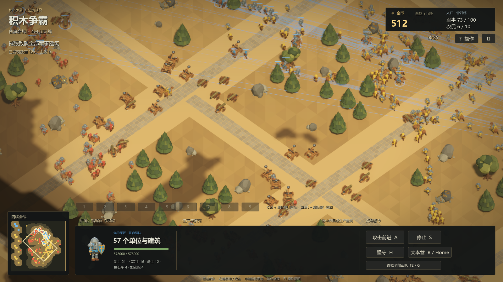

# 0.12：500 单位性能验收与候选取舍

日期：2026-09-10。关联数据：[结构化记录](release-0.12-performance.json)。

500 单位持续混编交战，批量模型与静止避让剪枝的 ABBA 样本从平均 **35.29 提升至 38.74 FPS（描述性增幅 9.8%）**，逻辑频率保持约 **30 TPS**。额外加入静态扫掠与路径缓存的同包候选对照为 **35.97 → 40.27 FPS**，但补测无法排除扫掠候选的密集改向长尾退步，**正式版建议关闭扫掠，仅保留实验代码**。38.74 FPS 是已测批量/剪枝组合的依据；不能把未发布的 40.27 FPS 候选当成最终产品表现。**没有达到稳定 60 FPS，不能据此宣布 896 单位问题解决**。

## 测量对象与边界

- Windows 官方 Godot 4.6.3 release template，Vulkan Forward+；i9-10900KF（10 核 / 20 线程）、RTX 3080；1600×900、正交 size 58、100% 渲染比例、4× MSAA、TAA，关闭 VSync 与帧率上限。30 TPS 与每渲染帧最多补 8 步保持原值。
- 4v4 地图固定 seed 803036；164 剑士、128 弓手、96 骑士、32 投石车、32 加农炮、48 农民，共 500 个真实单位。所有军队使用实际研究后的合法人口上限；48 农民实际采矿。
- 每场先预热 6 秒，再用真实墙钟测 20 秒；表格是排除命令发出后前 3 秒的稳态窗口，完整窗口也保存在 JSON。没有用固定帧率强行加速模拟、关闭动画或隐藏全军取得 FPS。
- HP ×100 仅用于维持同一人口压力，攻击、出手、投射物、视野、音效与采集继续运行；战略 Bot 与自然收入停用。这是持续负载夹具，**不是正常数值的完整对局，也不是八客户端联机 FPS**。18 场结束均保留 500 个存活单位；战斗场景每场实际发生数千次伤害。
- 保留用户原有编辑器与正常游戏。前 14 场及改向 A1 有同一个正常游戏；它在改向 A1 与 B1 之间自然退出，后 3 场仅余编辑器，故最后四场的 FPS 不能作为无背景变化的 ABBA 因果对照。每一场内部身份集合均稳定，没有其他验证 helper 并行；GPU 干扰未单独测量。这是同机受控对照，不能当作 GPU 独占实验。首组交战 ABBA 对时变干扰有一定约束，单次因素对照没有统计置信区间。
- 相同 seed 和命令不意味着 Jolt/RVO 逐位确定。路线、入镜数和交战分布会变化，表格因此同时给出可见数。不能把每次 FPS 差异全部分配给被测开关。

权威节点首尾标记只计 **SceneTree 物理回调区域**，不包含其外的原生物理/导航工作；“回调 P95”不是整权威步 P95。实际 TPS、帧时间、GPU 与渲染 CPU 分域记录，不简单相加。Godot 的 `TIME_PHYSICS_PROCESS` / `TIME_NAVIGATION_PROCESS` 缓存窗口最大值不冒充逐步 P95。

## 交战：同包 ABBA 与因素验证

| 场景／候选 | FPS | TPS | 帧 P95 / P99 ms | 回调均值 / P95 ms | GPU 均值 ms | 可见均值 |
|---|---:|---:|---:|---:|---:|---:|
| A1 原始 | 34.24 | 30.01 | 38.34 / 42.65 | 12.92 / 16.51 | 3.05 | 296.0 |
| B1 批量+静止剪枝 | 38.64 | 30.00 | 36.48 / 38.95 | 12.79 / 16.07 | 3.35 | 280.9 |
| B2 批量+静止剪枝 | 38.83 | 30.02 | 36.10 / 39.28 | 12.83 / 16.51 | 3.37 | 286.2 |
| A2 原始 | 36.34 | 30.00 | 37.42 / 40.05 | 12.70 / 16.32 | 3.00 | 278.6 |

A 为原始逐零件 MeshInstance 模型、原生导航与避让；B 仅加入 rigid MultiMesh 批量提交及静止单位 RVO 剪枝。原模型节点动画与攻击时间轴保留，没有启用蒙皮候选。

| 场景／候选 | FPS | TPS | 帧 P95 / P99 ms | 回调均值 / P95 ms | GPU 均值 ms | 可见均值 |
|---|---:|---:|---:|---:|---:|---:|
| 仅批量 | 38.91 | 30.03 | 36.63 / 40.15 | 12.83 / 16.33 | 3.35 | 284.0 |
| 仅静止剪枝 | 34.74 | 30.04 | 38.77 / 49.84 | 12.84 / 16.33 | 3.05 | 289.9 |
| 批量+剪枝+静态扫掠 | 41.20 | 30.03 | 35.57 / 38.84 | 12.56 / 16.12 | 3.35 | 282.1 |
| 最终对照：原始 | 35.97 | 30.03 | 37.56 / 40.82 | 12.71 / 16.04 | 3.00 | 282.1 |
| 最终候选：批量+剪枝+扫掠+路径缓存 | 40.27 | 30.04 | 35.75 / 38.95 | 12.76 / 16.87 | 3.38 | 286.9 |

前 7 场使用冻结包 base2；最后一对使用 base3。base3 仅让路径元数据/地图迭代缓存可独立开关，并新增两个聚合计数；两包运行时代码均来自 `2ba4579aa7b97fb16d74678c5f77e4eff341827e`。不把不同包之间的波动作为单因素定量结论。

最终同包对照中，frame setup CPU 均值 **3.762 → 0.653 ms**，render CPU **2.120 → 1.241 ms**，draw calls 约 **1203 → 927**；批量管理器自身仍花 **3.324 ms / 渲染帧**（完整采样窗口均值），GPU 为 **3.002 → 3.382 ms**。批量减少了逐零件渲染实例的提交成本，但 GDScript 每帧收集插值变换和写入 MultiMesh 仍然昂贵，并非“一个 MultiMesh 就没有 CPU 开销”。不要把这些有重叠、不同频率的指标直接相加计算整帧。

仅静止剪枝的 **34.74 FPS** 落在原始样本波动内，**独立 FPS 收益没有证明**。保留它基于此前静止安全性回归与减少不必要 RVO 工作的结构价值。静态扫掠在交战两个组合样本中有正向信号，但不能声称对所有移动场景都更快。最终完整组合每场确实产生数千次出手/伤害；所有批量场景采样期间 `capacity_growths` 增量为 0，预热后的扩容不是该组帧尾原因。

GPU 平均只占约 3 ms，与约 25–28 ms 帧时间相比，当前主要调查方向仍是 CPU/原生场景与模拟提交；这不是定位到唯一函数的证据。500 单位回调区域约 12.7 ms / 逻辑步、批量提交约 3.3 ms / 渲染帧都值得继续分解。不要用 FPS 的非线性变化直接推断 O(N²)。

## 行军、绕障与操作响应

这五场均固定启用批量模型和静止剪枝，仅改变导航候选。行军沿侧翼移动，在第 10 秒给 452 名军队同时下达反向命令；绕障横穿既有地形与障碍，两支方向的八个编队并行移动。

| 场景／候选 | FPS | TPS | 帧 P95 / P99 ms | 回调均值 / P95 ms | GPU 均值 ms | 可见均值 |
|---|---:|---:|---:|---:|---:|---:|
| 行军：原生导航 | 99.58 | 30.00 | 20.73 / 25.43 | 6.57 / 10.35 | 2.90 | 190.6 |
| 行军：共享流场 | 95.22 | 30.05 | 21.80 / 27.39 | 7.49 / 11.39 | 2.89 | 183.6 |
| 行军：扫掠+路径缓存 | 97.73 | 30.05 | 20.78 / 24.44 | 6.70 / 10.02 | 2.91 | 188.4 |
| 绕障：扫掠+路径缓存 | 56.18 | 30.03 | 30.25 / 33.80 | 7.42 / 10.53 | 3.51 | 304.6 |
| 绕障：再加共享流场 | 52.10 | 30.05 | 30.75 / 34.58 | 8.36 / 11.51 | 3.79 | 403.5 |

行军平均约 184–191 个模型入镜，因此其 95–100 FPS **不能与交战约 40 FPS 横比**。绕障共享候选改变了路线分布，平均入镜从 304.6 增至 403.5；52.10 对 56.18 FPS 不是纯流场 CPU 开销的隔离测量。

| 行军候选 | 首次位移 P95 | 反向达标 / 40 | 已达标反向 P95 | 观察期结束待达标 |
|---|---:|---:|---:|---:|
| 原生导航 | 739 ms | 37 | 4243 ms | 3 |
| 共享流场 | 630 ms | 35 | 3508 ms | 5 |
| 静态扫掠 + 路径缓存 | 740 ms | 36 | 6174 ms | 4 |

响应来自每队五类军事单位各一名，共 40 个代表。首动要求离开原点至少 0.15 m；改向还必须向新槽位有净推进、当前步朝新方向且不继续原朝向，不能把旧运动误当成新命令响应。这不是鼠标点击至 UI 反馈延迟，也不等于寻路计算耗时。反向分位数只统计观察期内达标者，**未达标人数一并给出，不能忽略这些删失样本**。

所有候选首动均在约 0.78 秒内，但一次同时命令 452 人仍有明显排队与密集改向长尾。扫掠候选组合已达标者的反向 P95 为 6.17 秒，一次样本不能断言扫掠造成退化，却足以说明**未证明操作长尾改善，不能宣称流畅度问题全部解决**。这个长尾应作为下轮具体调查目标。末尾所有军队位置有限；行军反向后距当前槽位均值原生 7.73 m、共享 7.53 m、扫掠候选 7.33 m；不据此声称轨迹逐位等价或全部抵达。

共享流场确实参与运行：行军建 12 个场，其中 2 个无效，产生 **87,735** 次共享采样；原生路径查询仅 **1592 → 1578**。绕障建 8 个有效场，产生 **164,535** 次共享采样，但仍有 **1139** 次原生路径查询；关闭共享是 1150 次。说明当前“共享采样”尚未实质消除每单位原生请求/重寻路工作。绕障首动 P95 都约 710 ms，整体没有支持默认开启共享的净收益证据。

路径迭代缓存是实际生效的：行军扫掠候选组合把原生地图迭代读取限制到 **599 次 / 20 秒**，另有 **252,619** 次缓存命中；原始行军原生读取 252,781 次。静态扫掠认证路径实际处理 144,663 步，原生回退仍有 107,948 步。绕障扫掠候选认证 238,412 步、原生回退 28,011 步。这里的“认证”省的是重复静态碰撞查询，不是删除动态避让或关闭碰撞。

绕障路线比 20 秒观察窗口长，扫掠候选军队相对出生位置平均移动 **50.45 m**、仍距终点平均 **68.31 m**；共享平均移动 53.10 m、剩余 61.31 m。不能把尚未走完整条长路线判为卡死，也不能将所有单位（含农民）的任务完成计数当作 452 人到达率。

## 密集改向疑点：补做同包 ABBA

额外 4 场只比较原生导航 A 与静态扫掠/路径缓存 B，batch/prune 均保持开启、同 base4 包、相同 10 秒改向命令；不重新测试其它场景。

| 顺序 | 2 秒内达标 / 40 | 4 秒内 / 40 | 8 秒内 / 40 | 10 秒内 / 40 | 未达标 | 达标者 P95 |
|---|---:|---:|---:|---:|---:|---:|
| A1 原生 | 27 | 33 | 36 | 37 | 3 | 5.97 s |
| B1 扫掠+缓存 | 30 | 33 | 35 | 35 | 5 | 4.51 s |
| B2 扫掠+缓存 | 32 | 35 | 36 | 36 | 4 | 3.07 s |
| A2 原生 | 29 | 34 | 37 | 37 | 3 | 5.80 s |

本轮没有复现“扫掠使已响应者稳定更慢”：B 的条件分位数反而较低；但 A 两次均 37/40 达标，B 为 35/40、36/40，**无法排除尾部行为退步**。所有组都有删失样本，不能拿已响应者 P95 较小来抵消未响应者更多。有限样本也不能证明扫掠本身必然有 bug；为避免以约 2 FPS 的候选收益交换不确定的操作体验，正式 0.12 关闭该候选，保留原生运动与动态避让，后续单独定位。

该组 A1/B1/B2/A2 FPS 为 103.44/103.77/109.62/109.49；B1 开始用户游戏已自然退出，因此这些 FPS 只记录、不给净收益归因。30 TPS、500 存活、有限位置、有效首动以及正常结束均通过。原生路径仍有明显拥挤长尾，关闭候选不代表这个产品问题已经解决。

## 0.12 纳入清单与后续工作

| 候选 | 0.12 建议 | 证据与限制 |
|---|---|---|
| 六类 rigid MultiMesh | 启用 | 同包 ABBA 与 batch-only 正向；保留原生节点动画、部件 LOD、队色、雾与死亡处理。每帧变换上传仍是下一热点。 |
| 静止 RVO 剪枝 | 启用 | 行为回归支持；本轮没有独立 FPS 提升结论。 |
| 静态扫掠网格 | 关闭，保留实验代码 | 交战正向，但补测无法排除未响应长尾退步；先保留原生运动。 |
| 省略无用路径元数据、按步缓存地图迭代 | 启用 | 原生读取数量显著下降；不是本轮整体 FPS 增幅的单独解释。 |
| 共享流场 | 关闭 | 真实接管不等于消除原生请求；行军与绕障净收益没有证明。 |
| 全军蒙皮 | 关闭 | 上轮未证明收益；这次不重复无价值矩阵。 |

下一步优先减少批量管理器在稳定可见集合中的逐帧脚本采集/原生 API 写入，继续拆分回调之外的原生阶段；并处理大量同时改向的排队/拥挤长尾。不能再只提高分频或创建流场，却让两条完整寻路管线同时做同样的工作。频率调整也必须保留运动、追击出手与碰撞安全边界。

## 数据身份、验收与画面

运行时代码固定为 `2ba4579`，不包含之后的快照批量复用提交 `4176ddf` 或最终发布配置。该联机优化有[独立验证](release-0.12-snapshot-batch.md)，不能叠加这里的 FPS 比例估算联机帧率。正式 0.12 PCK 与多人验证由发布流程另行记录。

| 测量包 | PCK SHA-256 |
|---|---|
| base2 | `cbbfaf208666ffd059ee5f2541bf2cfe502782e9ab8bdad1a7018bf04a6fec27` |
| base3 | `1710bbfd02c1da0bfb0b689d03a3e56db6b01e5336f194976e79d6a4cec91030` |
| base4 | `6fa67827a3c3236340aafbfee6595b1d62b46ef056a4a7fa4efdc389dba61bea` |

base4 只在测量停止后保存截图，没有把截图读回加入采样。三个包均用官方 release template，同源 Git archive SHA、template SHA 与新夹具 SHA 见 JSON。原始逐帧/逐步私有记录保留在本轮临时目录，公开文件仅归档允许字段，不含用户进程命令、连接凭据或服务器地址。

18 场真实渲染共 **18,560 项检查、0 失败**，所有结束单位数 500，stderr 均为空。每场之后都命令核实自有 helper 已退出；保留用户原有正常编辑器与游戏，用户后来自行退出游戏。没有把 headless smoke 的 FPS 当作性能数据。

原生计数陷阱：Godot 4.6.3 Forward+ 在启用 LOD 的 MultiMesh 分支中，`RENDER_TOTAL_PRIMITIVES_IN_FRAME` 没乘实例数，不能以其下降证明等量三角形工作减少。[对应原生源码](https://github.com/godotengine/godot/blob/4.6.3-stable/servers/rendering/renderer_rd/forward_clustered/render_forward_clustered.cpp#L1093)。表中 draw calls、GPU 时间与实际画面分别保留，不用错误 primitive 总量替代。

截图显示真实模型、己方蓝色/队友黄色/敌方红色与地形障碍。未发现缺件或整体染色异常；这张画面用于外观复核，不证明全部动作/网络边界已覆盖。其扫掠开关属于测量候选，最终正式版因上述改向疑点关闭。
