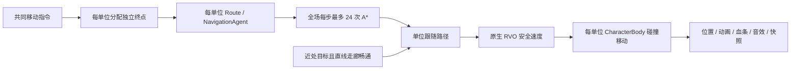
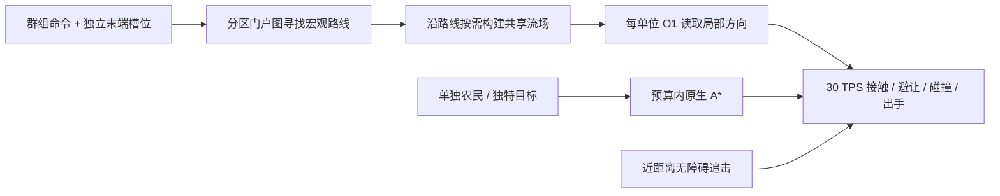

# 积木争霸：896 单位 CPU 瓶颈与 RTS 导航架构调查

日期：2026-09-10。范围：解释现有性能证据，核查《星际争霸 II》《帝国时代 IV》的公开实现，评估交错分频、共享寻路及移动执行层。**本报告是架构调查，不是已经完成流场改造或解决 896 单位性能的声明。**

## 1. 结论与改造顺序

**建议引入“群体共享路线／分块流场 + 高频局部执行”的混合导航；同时优先削减逐单位移动与动画的 CPU 成本。仅替换 A*，不足以从现有证据推出流畅的 896 单位战斗。**

当前并非每个单位每个逻辑步都重新寻路。每单位维护独立路径，但全场查询已经排队，每步最多 24 次；近距离无障碍追击还会绕过 A*。真正每单位每步都运行的是战斗状态、避让速度提交和移动回调。我们的不足是多个系统仍然以单个完整场景对象为工作单位，共同路线和重复状态计算的复用有限。

建议按三个可单独验收的方向推进：

1. **移动与表现解耦**：缩减重复的节点属性访问，验证平面移动快路，并把权威攻击时序从 AnimationPlayer 播放状态中独立出来。
2. **共享规划**：保留群组命令目标，分区找路、共享方向场，接近终点后再进入各自站位；先解决集体行军、集结和绕建筑。
3. **分层调度**：昂贵规划可跨步续算，采矿／恢复／状态文字按事件更新；移动接触与攻击出手保持统一权威时钟。进一步验证八客户端快照及表现成本。

这三个方向应分别对照测量，不能一次替换所有系统后只比较最终 FPS。

## 2. 2,124.352 ms 究竟是什么

下表全部来自同一次历史 `whole_callback` 诊断的 **280 个权威步**，不是把不同实验拼在一起。原始紧凑记录见 [0.11.0 性能 JSON](performance-0.11.0.json)。

| 工作 | 调用次数 | 累计时间 | 每步全场平均 |
|---|---:|---:|---:|
| 全军移动回调 | 250,880 | 2,124.352 ms | **7.587 ms** |
| ↳ 内含原生 `move_and_slide()` | 212,655 | 1,236.065 ms | **4.415 ms** |
| ↳ 回调其余工作 | — | 888.287 ms | **3.172 ms** |
| 全军单位物理逻辑 | 250,880 | 5,180.901 ms | **18.503 ms** |
| ↳ 追击方向处理 | 149,417 | 1,084.990 ms | 3.875 ms |
| ↳ 目标有效性检查 | 278,402 | 788.698 ms | 2.817 ms |
| ↳ 搜索新目标 | 22,771 | 107.893 ms | **0.385 ms** |
| ↳ 农民作业逻辑 | 26,880 | 248.661 ms | 0.888 ms |

带箭头的项目包含在父项内，且函数内部可能互相调用；不能把这些行全部相加。移动回调处于导航安全速度回调阶段，和单位自己的 `_physics_process` 是不同入口。

`250,880 = 896 × 280`：这次样本确实给每个单位每步调用了一次移动回调，平均每次约 **8.47 微秒**。原生移动约 **5.81 微秒／次**，平均每步 759.48 次，其余单位主要从零速度分支返回。问题是大量小操作反复执行形成的总成本。

`_apply_velocity()` 做的是设置速度、静态碰撞位移、读取真实速度、计算实际路程和脚步声距离；**其中没有 A* 搜索**。流场生成方向后，单位仍须执行这些工作，除非我们同时改造移动执行层。

同窗 A* 查询平均 **2.102 ms／步**。最终发布模板的另一次样本是 **3.503 ms／步、13.049 次／步，P95 6.456 ms**；它们不是同一组数据。最终样本中，寻路计时约占 SceneTree 标记均值 21.539 ms 的 16.3%。即使假设查询成本完全消失，该标记范围仍约 **18.036 ms**，还没有计入全部标记外工作和显示工作；真实流场也有构建成本。因此不能根据“替换寻路”直接承诺 60 FPS。

原生引擎诊断还测到完整物理步 42.211 ms，其中节点物理回调 30.465 ms、Navigation3D 8.260 ms、Jolt 服务器步进约 0.563 ms。Navigation3D **包含**安全速度回调及其中的角色移动，0.563 ms **不包含**前面已经执行的 `move_and_slide()`。这组数据使用临时编译器和后来撤回的实验，供阶段归因，不能当最终发行成绩。[原生诊断与边界](performance-native-0.11.0.md)

## 3. 为什么 3 倍单位会出现约 40 倍的 FPS 差距

| 最终发行模板历史样本 | 272 单位 | 896 单位 |
|---|---:|---:|
| 显示 FPS | 130.797 | 3.306 |
| 实际逻辑 TPS | 29.999 | 25.386 |
| SceneTree 标记均值 | 5.865 ms | 21.539 ms |
| 逻辑步／显示帧 | 450 / 1,962 | **384 / 50** |

单位数是 **3.294 倍**，标记均值是 **3.672 倍**。仅有两个样本不能拟合复杂度，但不支持由 FPS 差距直接推断“算法工作量增大 40 倍”。更符合证据的是主线程工作越过预算，累计欠下逻辑步，再以接近每显示帧 8 步的方式追赶，渲染迟迟得不到执行机会。

早期关闭视口 3D 的实验把 GPU 平均耗时从约 10.4 ms 降至 0.97 ms，FPS 仍约 1.7，支持那组场景由 CPU 主导。最终发行样本没有有效 GPU 时间数据，不能说最终 GPU 耗时为零，也不能保证其他镜头没有 GPU 瓶颈。[完整实验条件](performance-0.11.0.md)

固定步系统需要留下余量，否则补步工作会继续挤占下一帧。这个机制与 Glenn Fiedler 描述的固定步追赶问题一致。[Fix Your Timestep!](https://gafferongames.com/post/fix_your_timestep/)

在主线程串行的简化预算中，至少要满足：

```text
30 × 完整模拟步 CPU 耗时 + 60 × 每显示帧 CPU 耗时 + 其他主线程工作 < 1000 ms / 秒
```

这只是平均吞吐约束，稳定 60 FPS 还要求带物理步的那一帧也能按时完成。**将单步勉强压到 33 ms 不够。** 后续工程预算可暂定完整权威步 P95 ≤ 10 ms、显示侧主线程工作 P95 ≤ 5 ms，并检查组合帧和 P99；这是目标，尚未测成。减少最大补步数能缓解显示饥饿，却可能让模拟慢下来，不能算完成优化。

## 4. 商业 RTS 的公开技术：各自用了什么

### 《星际争霸 II》：分离思考、运动和显示

Blizzard 的 Bob Fitch 在 AIIDE 2011 原始演讲第 31／34 页介绍了 SC2 的动态三角区域、A*、圆形单位与电脑 AI 群组领队；第 67～69 页展示可跨帧保留工作位置的协作式 AI 时间切片。这证明“按预算续算思考任务”是可取经验，**不等于隔三帧才移动或判断攻击一次**。领队描述也不能扩大为所有玩家单位都只寻路一次。这里依据原始演讲，不把流场说成 SC2 已采用的方案。[会议与原始幻灯片](https://movingai.com/aiide11/speakers.html)

DeepMind 的 PySC2 官方文档描述 SC2 随游戏速度每秒推进约 **16～22 个模拟步**，中间显示帧采用插值。它说明模拟频率不必等于显示频率；不能据此把各游戏的 AI 调度、网络发送频率和显示 FPS 混为一个数字。[PySC2：Game and Action Speed](https://github.com/google-deepmind/pysc2/blob/master/docs/environment.md#game-and-action-speed)

对我们的启发：保留即时的选择与命令反馈，权威执行使用固定时钟，昂贵思考保存进度后续算，显示在逻辑状态之间插值。当前已经采用 30 TPS 和插值，缺少的是更低的每步成本及更彻底的数据／表现边界。

### 《帝国时代 IV》：分层 A*、流场与局部转向组合

Frank Cheng 的 GDC 2022 分享明确介绍 **hierarchical A* + flow fields + steering behaviors**，同时处理动态建筑、地形类型与不同单位尺寸。原始幻灯片第 13～22 页展示门户图和按需生成、可复用的分段流场，第 32～33 页展示虚拟编队领队与局部转向。设计需求为最多 8×200 单位、1024×1024 格；这不是每个士兵各建一张全图方向场。[GDC 原始分享与幻灯片入口](https://www.gdcvault.com/play/1027659/Pathing-in-Age-of-Empires)

它支持我们采用共享规划的方向，但其局部算法计时不能直接当作本游戏的整场 FPS，也不能把 AoE IV 的实现泛化到所有《帝国时代》版本。

### 《最高指挥官 2》：有可直接研读的流场工程拆解

Elijah Emerson 的原始章节解释了分区门户、代价／积分／方向场、缓存、动态障碍失效以及有预算的重建；同时保留局部转向和碰撞。这是理解流场从算法走向产品的重要材料，尤其说明共享与局部失效比“换一种搜索算法”更关键。[Game AI Pro 第 23 章](https://www.gameaipro.com/GameAIPro/GameAIPro_Chapter23_Crowd_Pathfinding_and_Steering_Using_Flow_Field_Tiles.pdf)

三者值得学习的是**不同粒度的工作使用不同表示与调度方式**。本轮未取得它们完整专有引擎源码，不声称能精确复刻其全部框架或解释其所有性能优势。

### 网络和多线程也要分清层次

《帝国时代》的《1500 Archers on a 28.8》原论文描述各机运行模拟、交换命令，并把通信回合与其中的多个模拟／显示帧分开。文中的约 200 ms 通信回合不能读成“全游戏只运行 5 Hz”。这种设计降低状态传输量，不会自动消除本机移动成本。[原作者论文](https://www.gamedeveloper.com/programming/1500-archers-on-a-28-8-network-programming-in-age-of-empires-and-beyond)

AoE IV 的《The MAW》官方摘要确认团队为多线程与单线程模拟结果一致构建了相应系统及验证工具。本轮未完整取得其内部实现，因此只把它作为“并行计算需要配套一致性验证”的依据，不杜撰具体任务图。[Joel Pritchett：The MAW](https://www.gdcvault.com/play/1027610/The-MAW-Safely-Multithreading-the)

## 5. 我们现在的导航与分频



可核查的入口：`scripts/path_budget.gd` 的 `register/request/next_position`，`scripts/battle_unit.gd` 的 `_physics_process/_chase_velocity/_apply_velocity`，`scripts/game.gd` 的 `move_formation`。Godot 自身也把路径查询、路径跟随和避让作为不同工作；设置新目标或偏离原路径会引发重算。[NavigationAgent3D](https://docs.godotengine.org/en/4.6/classes/class_navigationagent3d.html)

| 系统 | 现有频率／策略 | 本轮判断 |
|---|---|---|
| 权威单位运动与接触 | 30 TPS | 保留时序，降低每步成本 |
| 搜索新目标 | 0.3～0.4 秒，随机初始相位 | 已约 3 Hz，非最主要热点 |
| 追击重寻路 | 0.4～0.55 秒及目标移动阈值 | 继续区分高频接近与低频规划 |
| A* | 每步最多 24 次 | 有预算，无群体共享 |
| 迷雾 | 5 Hz，行差分 | 已优化，仍需保持可见性规则 |
| Bot | 1 Hz | 可错开各 owner 相位；历史压力夹具禁用了 Bot |
| HUD／小地图标记 | 约 8.3／6.7 Hz | 已分频 |
| 联机快照 | 每客户端 15 Hz、接收者分两相 | 不在历史离线压力样本里 |
| 离屏／迷雾内动画 | 自动休眠，必要时补姿态 | 已做，仍与权威挂点和快照有关联 |

没有发现战斗脚本让每个单位遍历全军的全配对循环。寻敌使用原生空间查询、返回最多 64 个结果；RVO 每单位最多考虑 10 个邻居。**返回数或邻居数有上限，不代表空间索引查询总成本严格 O(1)**，密集区域仍需单独测量。迷雾逐阵营处理实体，快照逐接收者处理实体，也各有与阵营／玩家数相关的常数。

Godot 官方推荐避免所有导航代理同时请求、避免每帧重设目标、简化导航多边形。项目已经实施其中多项；单纯重复这些配置不会补上共享路线这一层。[导航性能指南](https://docs.godotengine.org/en/4.6/tutorials/navigation/navigation_optimizing_performance.html)

### 本轮新增：真实 896 单位的查询结构采样

在当前工作树上复用原生 4v4 夹具，400 剑士、400 弓手、96 农民，预热 6 秒模拟时间后观察 **180 个权威步**。使用 Godot 4.6.3 官方编辑器引擎的无头模式与 `--fixed-fps 120` 加速时钟；保持原生 RVO、战斗与路径，生命 ×100、关闭 Bot 与自然收入。只给 PathBudget 增加计数，不改变寻路选择。**这不是发行版 FPS 基准，也不能与历史 13.049 次／步直接作性能比较。** 当前数值、最大档单独启动、随机数消耗、异步时序和渲染条件均可能影响战场状态。

最终采样的 21 项夹具检查通过，人数始终 896，发生 1,535 次受击事件。数据和源码指纹见 [本轮调查 JSON](rts-cpu-navigation-architecture-2026-09-10.json)。

| 指标 | 最终样本 |
|---|---:|
| 原生实际路径查询 | **660 次，平均 3.667 次／步，单步最多 14 次** |
| 实际提交过查询的单位 | 203 / 896 |
| 查询最新排队来源：持有战斗目标的 request | 657 次 |
| 查询最新排队来源：偏离走廊 | 3 次 |
| 查询执行时的命令 | 全部为攻击前进 |
| 不重复的精确目标向量 | **659 个** |
| 不重复的 1 米目标格 | 238 个 |
| 不重复的 16 米目标区块 | **11 个** |
| 记录中的 direct 路线模式 | 开始 583 个，结束 661 个单位 |

在六个不重叠的 30 步窗口里，再按半径和联盟分组，**没有一个精确目标组包含两个不同单位**；16 米目标区块组却覆盖了当窗 89.3%～100% 的查询单位，存在明显宏观共享潜力。这里的占比按不同单位计算，不是缓存命中率；同一目标区块不保证同一出口、连通分量、代价或合法流场。

`direct` 是缓存的路线策略，不表示该单位当步一定在移动。排队来源是观测到的最近请求上下文，不是精确函数调用栈；样本开始前的排队项可以在样本内执行，因此来源数和本窗口新增排队数不必相等。地图在这段样本中没有主动变动，无法据此评价施工时的失效成本。

这次采样证明的是：**精确终点共享不足、区域共享有机会，而且战斗阶段大量单位已经绕过 A***。它没有测出流场的实际节省，也没有解决移动与动画成本。

## 6. 交错分频应该怎样做

### 保持高频执行，只分频昂贵规划

例如把远距离路线维护分为三相：单位／群组按稳定 ID 分桶，每个逻辑步处理一桶，获得 10 Hz 的常规维护频率。**已有速度、局部接触判断、攻击冷却及出手仍在每个 30 TPS 步执行**。新命令、目标死亡、通路阻塞等事件立即标脏并进入优先队列，不必等待普通相位。

不建议让所有单位置于“本步不轮到我，所以整个回调 return”的模式。那会改变后撤追击、贴身出手、矿位释放和施工占地时机。历史 10 Hz 实验中，剑士追击弓手的有效攻击次数从 3 降到 2，缓存管理也抵消了节省，因此已撤回。[旧实验记录](performance-0.11.0.md)

### 给可中断任务工作量预算

规划队列保存 `request_id、generation、开始步、游标、累计展开数`；一次只处理一定数量的图节点／格子，下步续算。固定工作量便于复现；墙钟超时可作为主机保护，但不能改变已承诺攻击或金币的权威时间。队列采用优先级与等待时间提升，避免远处单位长期饿死。

对于一个耗时不可拆分的原生路径调用，查询数限制不能严格保证毫秒上限。短期可做任务排队和原生查询并行；长期分块规划才有更细的可中断粒度。先使用稳定的有界工作队列，按测量结果调整预算。

### 将稳定状态变为事件

农民站定采矿、恢复等待、生产完成等可保存开始时间与到期时间，仅在到期或状态改变时处理。界面由权威时钟推算进度。受伤、离开作业范围、科技改变采集速率、死亡、取消命令时重排事件，并保留已完成比例；死亡与占位释放仍即时处理。

目前农民作业分支每步还在格式化不变的采矿说明文字、写工作条参数，适合改为状态变化和可见表现更新。但整个作业逻辑历史平均只有 0.888 ms／步，应把它视为明确的小收益，不是主解法。

## 7. 流场的具体落地设计

以下是针对本项目的工程方案，尚未作为运行时实现。

### 保留共同目标，末端才分散

现在 `move_formation()` 一开始就为每人生成不同站位。如果直接把精确终点当缓存键，很多查询无法复用。应令一个群组命令持有共同目标区域与共享路线句柄，单位另持自己的末端槽位。前半程共享绕山／绕建筑路线，接近终点后精确收敛。



### 分块、半径、缓存和失效

- 以现有 1 米通行格为起点，先比较 16×16 与 32×32 分区；边界门户维护连通性。大小是候选值，不照搬商业游戏参数。
- 通行类别按实际尺寸／移动规则分组，不能让大炮沿只容得下步兵的方向场穿缝；尺寸膨胀应来自真实障碍与碰撞半径。
- 缓存键至少包含通行类别、分区、出口／最终目标和依赖的拓扑版本。共享门户场可服务不同最终目标，最终目标场只服务相应目标。路径不是仅按终点坐标缓存。
- 建造、拆除、障碍改变时，更新实际受影响分区、边界连接和依赖路线；**关闭通道必须立即阻止旧路线穿入**。新通道可以等重算后使用。
- 门户关闭可能让远方路线的可达性发生变化；“只重建局部格子”不等于“只有附近单位需要重新选路”。需要反向依赖或连接版本验证。
- 不把每个移动单位都写成静态障碍触发流场重建。拥挤由局部转向处理，必要的拥堵代价低频更新并设置滞回，防止两条路反复切换。
- 各字段使用连续数值数组，复用计算缓冲与任务槽，不给每格建立一个 Node 或 Dictionary。容量有界、引用计数和 LRU 管理空闲缓存。

方向读取可以 O(1)，但场的构建不是：等边权网格可 BFS，带权网格可使用 Dijkstra／有界整数代价队列；分区内二叉堆方案约 O(K log K)。共享的意义是把 N 次重复工作变为少量场构建加 N 次读取。目标各不相同、地图频繁变化时，缓存收益会下降，必须保留小规模原生路径分支。

作为容量算例，若每格保存 4 字节积分代价和 1 字节方向／标志，16×16 的场净数据为 1,280 字节；512 个场约 640 KiB。此数不含通行图、门户、优先队列、任务和容器开销，更不是完整运行内存承诺。

### 多线程与多人同步

工作线程只能读取不可变通行快照、计算纯数据，在主线程提交时检查命令代次和地图版本；死亡、改令或建筑变化后完成的旧任务丢弃。不要把活动场景节点分给线程随意改属性。Godot 的导航查询允许线程使用，但共享 AStar 辅助对象与活动 SceneTree 并不具有同样的安全性。[Godot 线程 API 边界](https://docs.godotengine.org/en/4.6/tutorials/performance/thread_safe_apis.html)

仍由房主产生和消费路径，客户端接收过滤后的状态，不需要各自重建一致流场。记录任务在哪个权威步提交，保留命令序号、owner 校验、代次与可见性过滤；工作线程完成先后不能决定金币、伤害或隐藏信息的对外暴露。无需为这次优化把 ENet 房主权威系统整体改成确定性锁步。

## 8. 真正针对移动和场景成本的改造

### 静态碰撞平面快路

当前单位碰撞层只与地图／建筑交互，单位间由 RVO 避让。可原型验证：对 **RVO 算出的本步位移**，证明整个扫掠体积无静态障碍后直接做平面积分；靠墙、矿脉、门口等边界区域继续精确碰撞。它直接针对历史 4.415 ms／步的原生角色移动项。

不能只检查终点可走，也不能直接把现有导航格当作物理碰撞形状的严格替代。已有走廊测试验证了格子算法，未证明其覆盖全部真实圆岩、矿脉、建筑碰撞体。必须与原生物理扫掠对照，检查半径、斜角、施工同步插入、地图边缘；快路还要正确更新真实速度、空间查询位置、插值与脚步路程。若验证／提交成本高于节省，就撤回该原型。

不要简单关闭所有静止单位的避让：它们仍然需要形成堵口和可推挤的人群。更进一步可采用活动移动列表、被动阻挡表示及原生平面运动批处理，而非每帧对 896 个完整对象反复跨边界读写。

### 权威状态与动画姿态分离

静态场景计数：400 剑士、400 弓手、96 农民，加公共单位层级，共 **22,096 个节点、1,792 个 AnimationPlayer、7,760 个模型网格实例**，另有 2,688 个血条／工作条／选圈实例。这是创建规模，不表示全部可见、绘制或播放；网格资源已经共享。

每个单位两个 AnimationPlayer，部分动作写入多层部件变换；网络快照读相位和权威出手读挂点时仍会触发姿态同步。历史停动画消融有明显收益，但改变了战场状态，不能把 FPS 差额完全归给 AnimationPlayer。

建议权威层存储动作开始时刻、冷却结束、释放时刻和挂点描述，动画仅消费这些数据。先让快照直接读权威动作数据，减少为联网而求姿态；再验证释放挂点的专门求值。可见姿态按屏幕尺寸选择更新频率并插值，重要出手事件不能丢。后续确有证据时再评估骨骼合批或 GPU 动画，不能用一次模型重写代替测量。

集中处理紧凑的实体状态可以降低重复对象访问，但“把所有 GDScript 回调挪进一个循环”本身不保证提速；必须真正减少跨对象／原生调用与重复状态求值。Godot 支持保留原生场景编辑，同时在热点使用较低层 Server API；资源和 RID 生命周期需要明确归属。[Godot Server 优化](https://docs.godotengine.org/en/4.6/tutorials/performance/using_servers.html)

## 9. 分阶段实验与通过条件

| 阶段 | 只改变的变量 | 主要指标 | 正确性门槛 |
|---|---|---|---|
| A | 新增请求来源／目标分组计数 | 真正重算原因、目标共享潜力、排队时长 | 计数不修改命令或路径 |
| B | 平面移动快路与状态访问 | 原生移动调用数、移动阶段净耗时 | 与真实静态碰撞一致、矿边／门口不穿越 |
| C | 群组共享门户路线／分块流场 | 构建成本、命中率、最大待路时间 | 混合体型、断路、绕路、末端编队均正确 |
| D | 规划错峰与事件更新 | 整步 P95/P99、事件队列延迟 | 追击有效命中、释放时刻、采矿收益不变 |
| E | 权威动作数据与表现分离 | 动画／变换 CPU、快照编码成本 | 可见动画和弹丸挂点正确，迷雾不泄露 |
| F | 完整发行版复测 | 272／896、1v1／4v4、八客户端 FPS/TPS | 30 TPS、交互延迟与完整对局通过 |

实验至少拆为共同目标行军、窄口交汇、各自追击、静止战斗、农民采矿、动态封路六类。每项保留相同发行引擎、初始单位位置、固定命令时间线和随机种子，交替重复运行。异步避让／导航会使后续状态有差异，仍需记录实际人数、移动量、查询量及受击事件，不能把“种子相同”当作状态必然完全相同。

完整指标包括：完整权威步和显示帧 P50/P95/P99、A* 与流场成本、静态碰撞次数、活动动画数、CPU／GPU 实际计时、命令至开始移动的延迟、路径完成率、穿透与卡住次数、追击有效攻击次数。原生计时边界要包含导航安全速度回调；不能只用 SceneTree 标记或每秒缓存峰值验收。

本轮不会以降低模拟时间、取消伤害、隐藏所有模型或仅测共享目的地算法微基准的方式宣布性能达标。最终方向是降低每单位必做工作的成本，并让可共享、可延期的工作真正被共享和延期。

## 10. 本轮交付与清理

交付本报告、紧凑调查 JSON 和 README 入口。未改动游戏运行逻辑、数值、发布包或中继服务。新增采样的 21 项夹具检查通过，另核对了 21 项计数、窗口汇总和源码指纹；二者不代表流场实现或帧率目标已通过。

命令核实仅保留用户原有 Godot 编辑器，没有本轮无头／检查进程。删除 `.local/rts-path-audit-20260910` 的操作被自动审批以 **blocked by policy** 拒绝，未改用其他方法删除。该新目录仍保留 8 个临时脚本、场景及日志文件，共 28,902 字节，未纳入 Git。报告 JSON 保留最终采样结果与探针源码指纹，方便审查数据来源。
