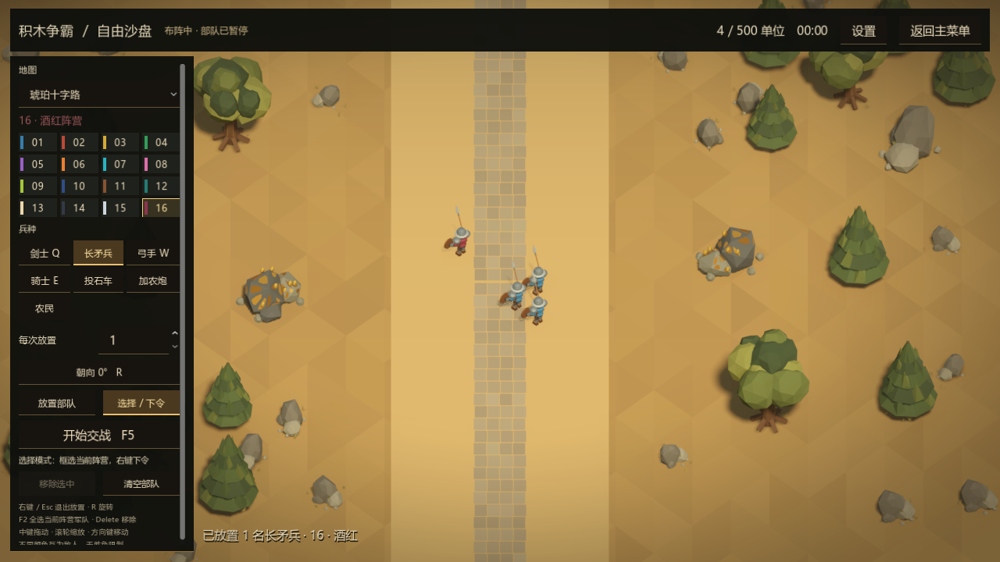

# 长矛兵制作与兵种调整

2026-09-11，Godot 4.6.3。长矛兵已接入兵营、图鉴、头像、自由沙盘、AI 配兵与战场批量渲染。

## 最终数值

| 兵种 | 金币 / 制造时间 | 生命 | 攻击与类别附伤 | 近甲 / 远甲 | 移速 |
| --- | --- | --- | --- | --- | --- |
| 长矛兵 | 40 / 6秒 | 75 | 6，对骑兵+20 | 1 / 1 | 3.7 |
| 剑士 | 60 / 6秒 | 110 | 9，对骑兵+5 | 2 / 2 | 3.7 |
| 投石车 | 240 / 20秒 | 140 | 32，仅对建筑+50 | 0 / 2 | 2 |
| 加农炮 | 255 / 20秒 | 180 | 40，仅对建筑+100 | 0 / 2 | 2 |

长矛兵使用普通步兵速度、1军事人口、1射程、1.2秒攻击间隔和14视野。剑士远程护甲从1提高到2。投石车按确认将溅射半径3.0缩到2.7，射程保持13，落点固定、范围内满伤且不伤友军；移除步兵附伤。任务开始时文件中的投石车攻击为18，本次以指定最终值32为准。

无科技时，长矛兵对骑士实际伤害24，需要5击；剑士对骑士实际伤害12，需要10击。投石车对剑士30、对长矛兵31、对弓箭手27；仅按各自远程护甲扣减，没有对步兵的额外伤害。

## 模型与动作

沿用既有蓝金配色、低多边形比例和共享顶点着色材质。新制敞口宽檐钢盔、皮胸甲、圆盾、缠绳长木矛、钢制叶形矛头和金属尾鐏。模型为7个刚性部件、4692个三角形，带待机、行走、突刺动画；0.22秒出手，0.88秒动作收回，保留1.2秒完整攻击间隔。

矛柄始终固定在手掌处，命中时矛尖水平向前，之后收势回到持矛姿态。图鉴在查看攻击时自动拉远取景，四个方向的矛尖均在画面内；回到待机时恢复较近视角。

模型与动画保存在可编辑的原生 `.tscn`、ArrayMesh 及 AnimationPlayer 中，战场使用已有 MultiMesh 批量渲染结构。建模源为 `tools/build_units.py`，可通过 `python tools/build_units.py spearman` 单独重建该兵种。遵循 [Godot PackedScene](https://docs.godotengine.org/en/stable/classes/class_packedscene.html) 与 [AnimationPlayer 动画结构](https://docs.godotengine.org/en/stable/tutorials/animation/introduction.html)。

## 使用与验证

兵营当前快捷键为 Q剑士、W长矛兵、E弓手、R骑士。自由沙盘新增长矛兵按钮，支持全部16个沙盘阵营。AI 会统计己方、排队和已见敌方长矛兵，并在敌方骑兵较多时提高长矛兵招募比例。

| 检查 | 通过数 |
| --- | ---: |
| 原生与批量模型变换、动画及挂点一致性 | 1829 |
| 七兵种伤害矩阵与科技组合 | 1390 |
| 实体近战、长矛前摇与五次击杀骑士、弹丸伤害 | 82 |
| 投石车中心、边缘、建筑占地、友军及发射者死亡 | 255 |
| 生产计时、扣款、堵塞出口、取消退款与人口 | 128 |
| 头像渲染、裁切和缓存 | 121 |
| 弓箭伤害与视野 | 122 |
| 各兵种原生出场位置 | 53 |
| 发布诊断中的资源值检查（本地执行） | 72 |
| 图鉴四向取景、沙盘放置、选择、移动、暂停、到达及AI识别 | 35 |

上述最终检查均为0失败，最终日志无脚本错误。详细结果见 [validation.json](spearman-20260911/validation.json)。旧 `worker_ai_host` 移动测试缺少当前游戏接口，未计入通过项；以实际沙盘中的原生移动、暂停、恢复和到达检查验证长矛兵。用于战斗测试的最小宿主已补齐当前阵营展示接口。

本次没有发布新的Windows安装包或执行公网中继对局，没有进行帧率压测。提交的内容清单按暂存源码生成，以保留工作区已有的其他修改。

全部验证进程均已退出。通过 `Get-CimInstance Win32_Process` 专门核实 `--headless` / `--check-only` 的 Godot 测试进程数量为0，保留用户的正常编辑器。
