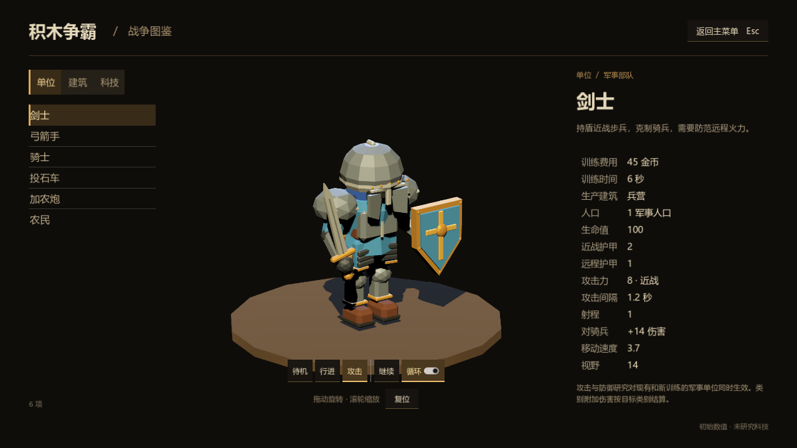
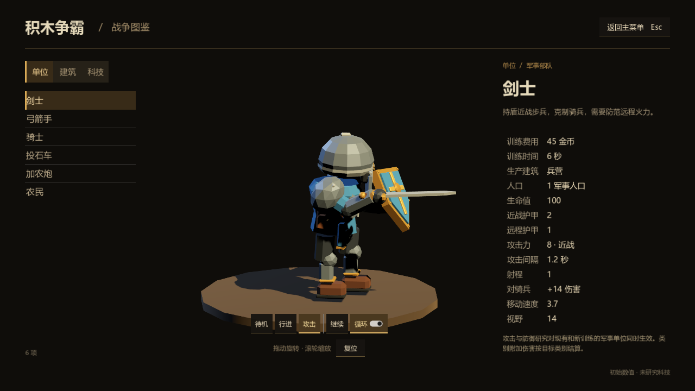
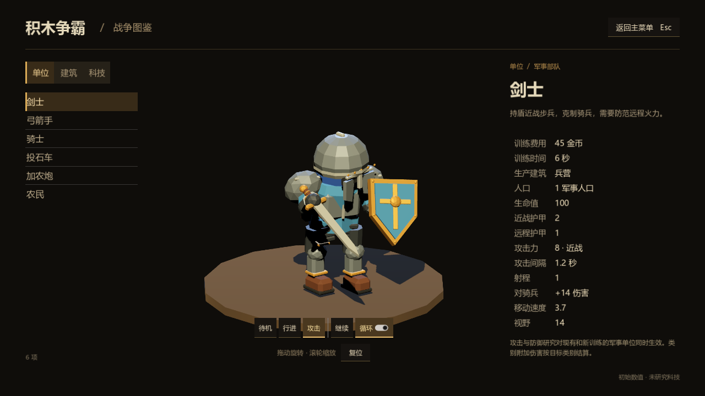
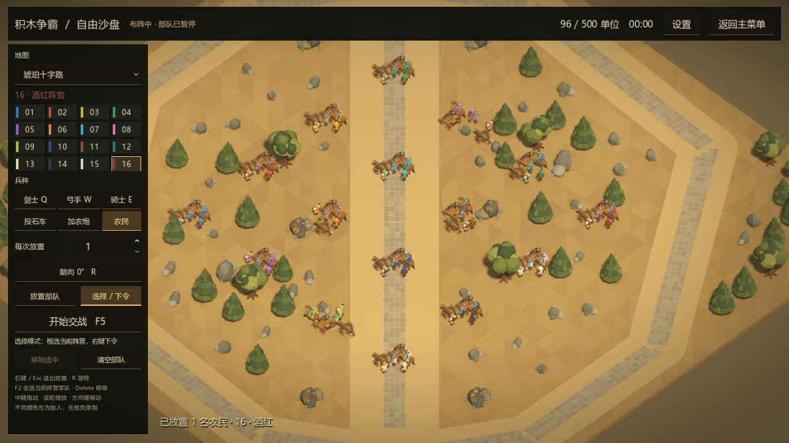

# 剑士挥剑修正与自由沙盘验收

日期：2026-09-11。Godot 4.6.3，Windows，RTX 3080。

## 剑士模型与动作

- 下移、收薄胸甲，调整头盔位置，为护颊与胸甲留下间隙。
- 右前臂向前弯曲，手部移到身体外侧；待机剑刃略向外倾斜。
- 将剑从右臂合并网格拆为原生 `ArmRight/Sword` 子节点。剑以握柄处为旋转轴，与手臂、腰部协同完成蓄力、向前下斩和收势，剑柄始终随手掌运动。
- 保持攻击动作长度 0.86 秒、出手时点 0.22 秒及原有攻击间隔；没有修改伤害、射程或兵种数值。
- 同步更新原生模型、生成源文件和战场批量渲染场景。剑士由 6 个刚性部件变为 7 个，继续共享网格和 MultiMesh 批次，没有另加逐单位脚本回调。

实机正面与左右侧面检查覆盖待机、蓄力、命中、下斩和收势。下图是实际 Godot 渲染画面。

## 自由沙盘

主菜单新增“自由沙盘”。进入后默认暂停，先放置部队，再开始交战。

| 功能 | 行为 |
| --- | --- |
| 地图 | 琥珀十字路、双谷争锋、三线烽火、四旗会战、三盟盆地、落冠荒原；切换地图清空当前布阵 |
| 阵营 | 16 个独立阵营，各有固定颜色和名称；不同阵营互为敌人，切换操作阵营不会重新染色 |
| 兵种 | 剑士、弓箭手、骑士、投石车、加农炮、农民 |
| 放置 | 单次 1～50 个，总数上限 500；按阵列放置，可旋转朝向；占用、矿脉、障碍物和不可通行位置不能放置 |
| 指挥 | 切换至选择模式后操作当前阵营，保留框选、右键移动/攻击、Shift 连续指令及编队 |
| 编辑 | 可继续增兵、移除选中单位、清空部队；无需资源与建筑生产 |
| 暂停 | F5 或按钮切换布阵与交战；暂停后部队和弹丸停止，镜头与界面仍可操作 |
| 返回 | 支持设置入口与返回主菜单，切换场景先释放战斗对象与音频 |

默认快捷键：Q/W/E 选择剑士/弓手/骑士，R 旋转放置方向，Esc 或右键退出放置，F2 选择当前阵营全部军事单位，Delete 移除选中单位，A 攻击前进、S 停止、H 坚守、空格聚焦。使用现有热键设置解析器。

16 个颜色为：苍蓝、朱红、金黄、翠绿、紫罗、橙焰、青空、蔷薇、青柠、深蓝、棕木、松石、象牙、墨黑、银白、酒红。颜色搭配数字和名称，便于分辨相近色。

该入口是离线布阵与交战工具，没有战争迷雾、经济经营和自动胜负结束。16 阵营用于沙盘兵种，不扩展联机房间人数。本次未修改协议、发行包或 Relay 服务。

## 结构与开销

- `sandbox.gd` 复用既有战斗控制器的单位生成、伤害、命令验证、寻路、编队与对象池，仅提供独立沙盘生命周期。
- 菜单、侧栏、颜色按钮、预览和世界结构均为可编辑 `.tscn` 原生场景。
- 原有八队战斗层不变，使用剩余的八个物理层承载额外沙盘阵营。继续由原生物理过滤友方目标，不改成遍历全部单位索敌。
- 单位模型共用批量渲染器、网格和阵营着色路径；放置预览预载入六个原生模型。
- 单位总数在出生、死亡、删除时 O(1) 更新。HUD 每秒刷新 5 次；鼠标预览的有效性检测每秒 10 次，复用形状查询对象且最多取一个阻挡结果。
- 暂停采用原生处理模式；单位的 `disable_mode` 为 `DISABLE_MODE_KEEP_ACTIVE`，因此暂停仍保留占位和鼠标拾取。第一轮截图暴露了默认禁用模式会移除物理体、导致暂停放置重叠的问题，修正后增加了 96 项占位检查及同帧重复放置检查。[Godot CollisionObject3D 文档](https://docs.godotengine.org/en/4.6/classes/class_collisionobject3d.html)

## 验证结果

| 检查 | 结果 |
| --- | --- |
| 原生/批量模型动画与变换一致性 | 1621 项通过，0 错误；最大变换与挂点误差均为 0 |
| GPU 模式下的模型、沙盘及普通对局检查 | 286 项通过，0 失败 |
| 握柄与斩击 | 8 个动作时点握柄位置不变，0.22 秒剑刃朝前；另检查左右侧面各 4 个姿势 |
| 16 阵营放置 | 6 类单位各放置 16 阵营，共 96 个；颜色、碰撞层、暂停占位均通过 |
| 交战 | 第 9 与第 16 阵营自动索敌并互相伤害；同阵营不作为敌人；第 16 阵营加农炮实际发射并命中 |
| 暂停 | 移动中的单位在暂停后位置、生命与模拟时钟保持不变，恢复后继续运行 |
| 500 单位 | 通过实际放置路径达到 500；拒绝第 501 个；500 单位可全选并接受统一命令；清空后批次注册数归零 |
| 六张地图 | 逐张切换并放置高编号阵营骑士，切换后的部队数归零 |
| 删除与切换 | Delete 清除选择与数量；切换阵营清除待执行攻击模式；矿脉注册不因清空部队丢失 |
| 热键 | 原生 Window 输入事件验证 F5 开始/暂停、设置中 F5、R、E、Esc、F2、Delete |
| 普通 1v1 回归 | 两名玩家、玩家开局 3 名农民和相对阵营颜色保持原状 |
| 桌面交互 | 主菜单进入、地图下拉切换、批量放置 8 个单位、第 16 阵营弓手、旋转按钮、交战、设置和返回主菜单实际操作通过 |

500 单位项目验证的是容量、选择与命令正确性，不是新的帧率压测，不能据此宣称 500 单位满负载帧率提升。桌面自动化工具发出的 F5/R 事件携带相同的错误物理键码，因此快捷键单独使用 Godot 原生输入事件验收；没有为自动化工具修改正式按键处理。

验证只使用本任务新建的临时脚本，正式截图保留于本报告目录。验证进程均已退出，最终通过 `Get-CimInstance Win32_Process` 核实，仅保留用户的 Godot 编辑器（36624）及用户启动的游戏（42876）。

本次临时目录 `.local/sword-sandbox-20260911` 的删除被自动审批拒绝，原因为 `blocked by policy`，因此测试脚本、日志与中间截图仍留在该目录；没有换用其他方式删除，也没有重试删除旧任务中已经被拒的目录。该临时目录被 Git 忽略，没有进入公开仓库。
